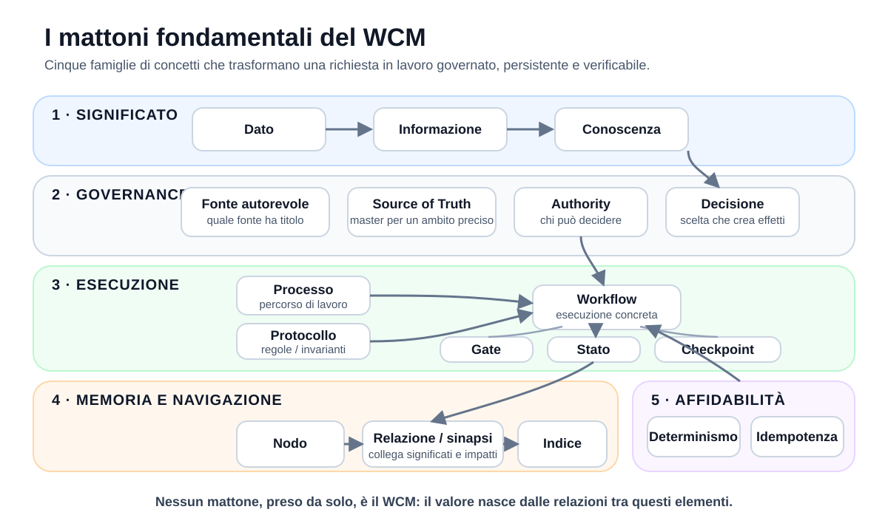

# Capitolo 02 — I mattoni fondamentali

**Stato:** FROZEN  
**Blocco:** 1 — Fondamenti + Dual Memory  
**Scope:** WCM generale / domain-agnostic  
**Technical Review:** PASS — 2026-08-25  
**Human Comprehension Review:** PASS — 2026-08-25  
**Figure:** FIG-002 APPROVED / EMBEDDED

---

## Prima di costruire l'architettura, serve un linguaggio comune

Nel capitolo precedente abbiamo visto il problema da cui nasce il WCM: trasformare una capacità cognitiva potente, ma legata al contesto, in un sistema capace di lavorare nel tempo con memoria, regole, stato, continuità e governo.

Da qui in avanti entreremo progressivamente nell'architettura vera e propria. Prima, però, serve un vocabolario comune.

Molte parole usate nei sistemi informatici sembrano intuitive finché non vengono messe una accanto all'altra. *Dato*, *informazione* e *conoscenza* vengono spesso trattati come sinonimi. *Processo*, *protocollo* e *workflow* sembrano indicare tutti una sequenza di attività. *Autorità*, *fonte autorevole* e *source of truth* possono sembrare tre modi diversi per dire «la cosa giusta». *Determinismo* e *idempotenza* vengono confusi perché entrambi riguardano l'affidabilità.

Nel WCM queste distinzioni sono importanti perché ogni concetto svolge una funzione diversa.

Un modo utile per leggere questo capitolo è immaginare che stiamo costruendo una piccola grammatica dell'organizzazione. Le parole sono i mattoni. Il WCM nasce dal modo in cui questi mattoni vengono collegati.



La figura raggruppa i concetti in cinque famiglie:

- **significato** — come passiamo da qualcosa che osserviamo a qualcosa che possiamo usare per ragionare;
- **governance** — come distinguiamo ciò che vale, chi può decidere e quali decisioni producono effetti;
- **esecuzione** — come il lavoro viene organizzato, controllato, interrotto e ripreso;
- **memoria e navigazione** — come la conoscenza persistente viene organizzata e raggiunta;
- **affidabilità** — come le parti meccaniche vengono rese prevedibili e resistenti a duplicazioni.

Nei paragrafi successivi ogni termine viene introdotto partendo da un esempio semplice, poi viene definito nel linguaggio del WCM.

---

## 2.1 Dato

Immaginiamo un termometro che mostra:

```text
21,7 °C
```

Quello è un **dato**.

Preso da solo, non ci dice ancora se la stanza è confortevole, se la temperatura è salita, se dobbiamo accendere il riscaldamento o se esiste un problema. È una rappresentazione di qualcosa che è stato osservato, misurato o registrato.

Per questo libro useremo una definizione operativa molto semplice:

> **Un dato è una rappresentazione elementare di un fatto, evento, valore o osservazione.**

Un dato può essere un numero, una parola, un identificatore, una data, uno stato registrato, un valore booleano come `true/false`, oppure un insieme strutturato di campi.

Nel WCM i dati sono importanti soprattutto quando diventano **strutturati**. Se un workflow possiede un campo:

```text
status = WAITING_AUTHORITY
```

quel valore è un dato esplicito. Proprio perché esiste in forma strutturata, un componente non dovrebbe ignorarlo e provare a ricostruire lo stesso stato interpretando liberamente una frase descrittiva.

Questo principio tornerà più avanti come **structured-before-text**: quando una informazione operativa è già rappresentata in modo preciso, non serve trasformarla nuovamente in una domanda di interpretazione.

Il dato, quindi, è il mattone più elementare. Non è ancora conoscenza. Ma senza dati affidabili, tutto ciò che viene costruito sopra di essi diventa fragile.

---

## 2.2 Informazione

Torniamo al dato:

```text
21,7 °C
```

Se aggiungiamo:

> «È la temperatura della sala riunioni alle 9:00»

abbiamo dato **contesto** al dato.

Se aggiungiamo anche:

> «Ieri alla stessa ora erano 18,5 °C»

possiamo comprendere che la temperatura è aumentata.

Questo è il passaggio dal dato all'**informazione**.

> **Un'informazione è un dato interpretato o contestualizzato in modo da assumere un significato utile.**

Il dato dice *che cosa è stato registrato*. L'informazione aggiunge elementi che permettono di capire *che cosa significa in quella situazione*.

Nel WCM questo passaggio è continuo. Un timestamp da solo è un dato. Sapere che quel timestamp rappresenta l'ultimo checkpoint di un workflow è informazione. Sapere che il checkpoint è precedente all'ultima modifica materiale può indicare che lo stato persistente non è più sufficientemente aggiornato.

La distinzione è importante perché un sistema non deve trattare tutti i valori come se fossero autosufficienti. Alcuni dati diventano operativamente utili soltanto quando vengono letti insieme a tipo, stato, ambito (scope), fonte e relazioni.

---

## 2.3 Conoscenza

L'informazione diventa **conoscenza** quando può essere utilizzata per comprendere una situazione, orientare un'azione o collegarsi stabilmente ad altre informazioni.

Un esempio quotidiano:

- dato: `21,7 °C`;
- informazione: «la sala riunioni è a 21,7 °C alle 9:00»;
- conoscenza: «questa sala tende a superare la temperatura impostata quando l'impianto parte troppo presto».

La conoscenza non è semplicemente «più testo». Contiene relazioni, interpretazioni, regole, storia o significati che consentono di utilizzare le informazioni in modo coerente.

Nel WCM possiamo usare questa definizione:

> **La conoscenza è informazione organizzata e contestualizzata in modo sufficientemente stabile da poter essere recuperata, collegata e utilizzata nel lavoro futuro.**

Una decisione approvata è conoscenza organizzativa. Un protocollo attivo è conoscenza organizzativa. Sapere che una decisione ne sostituisce un'altra è conoscenza perché conserva non soltanto due testi, ma anche la relazione tra essi.

Questo porta a una prima distinzione fondamentale:

```text
AVERE CONTENUTI
!=
AVERE CONOSCENZA ORGANIZZATA
```

Una cartella piena di documenti può contenere moltissime informazioni e, contemporaneamente, essere difficile da utilizzare come memoria organizzativa se non sappiamo quali documenti sono correnti, quali sono autorevoli e come sono collegati.

---

## 2.4 Stato

Immaginiamo di seguire una spedizione.

Non ci interessa soltanto sapere che esiste un pacco. Vogliamo sapere se è:

```text
PREPARATO
SPEDITO
IN TRANSITO
CONSEGNATO
```

Lo **stato** descrive la condizione corrente di qualcosa secondo un insieme di possibilità definite.

> **Lo stato è una rappresentazione della condizione corrente di un oggetto, sistema o attività rispetto a un modello esplicito.**

Nel WCM lo stato serve a rispondere a domande come:

- dove si trova il lavoro?;
- è in corso, interrotto, bloccato o completato?;
- deve essere ripreso?;
- attende una decisione umana?;
- quale transizione può avvenire dopo?

Un punto importante è che **stato e descrizione non sono la stessa cosa**.

Una frase come:

> «Siamo praticamente alla fine»

è una descrizione informale.

Un campo come:

```text
status = ACTIVE
next_transition = VERIFY_OUTPUT
```

è uno stato strutturato.

Quando il WCM dispone di uno stato strutturato, le parti meccaniche devono preferirlo al testo libero. È uno dei modi con cui il sistema riduce la possibilità che due componenti interpretino diversamente la stessa situazione.

Lo stato può esistere a livelli diversi. Possiamo avere stato di un workflow, stato di una risorsa, stato di una decisione o stato di salute della memoria. Non esiste quindi un unico «stato del WCM» che sostituisce tutti gli altri.

---

## 2.5 Decisione

Una **decisione** non è semplicemente una informazione che il sistema ricorda.

Se una persona dice:

> «Potremmo scegliere A»

ha espresso una proposta.

Se dice:

> «Ho deciso: scegliamo A»

ha prodotto una decisione, a condizione che possieda l'autorità necessaria per farlo.

> **Una decisione è una scelta dotata di sufficiente authority da modificare ciò che il sistema deve considerare valido, consentito, richiesto o pianificato.**

Nel WCM una decisione significativa viene trattata come un **nodo causale**. Questo significa che può produrre conseguenze: requisiti, attività, documenti, vincoli, nuove decisioni.

Per questo una decisione non viene pensata come una frase isolata.

Può avere:

- un autore o un'autorità;
- una data;
- una motivazione;
- uno stato;
- una decisione precedente che sostituisce;
- elementi da cui dipende;
- elementi che dipendono da essa.

Se una decisione cambia, il WCM cerca di preservarne il **lineage**, cioè la storia della sostituzione e degli effetti. La vecchia decisione non deve necessariamente scomparire: può diventare `SUPERSEDED`, mantenendo visibile come si è arrivati alla decisione corrente.

Questa proprietà è essenziale per distinguere memoria da semplice sovrascrittura.

---

## 2.6 Fonte autorevole

Supponiamo che tre persone ci dicano tre date diverse per una riunione. Non basta sapere quale informazione è stata scritta per ultima. Dobbiamo sapere **chi o che cosa ha titolo per stabilire la data corretta**.

Una **fonte autorevole** è una fonte alla quale il sistema attribuisce un livello riconosciuto di autorità per un determinato contenuto.

> **Una fonte autorevole è una fonte che, secondo governance e ambito (scope), ha titolo per rappresentare una informazione o decisione nel proprio ambito.**

Nel WCM «autorevole» non significa semplicemente «sembra affidabile», «è recente» o «è scritto bene».

L'autorità dipende dal ruolo della fonte.

Una nota sperimentale può essere più recente di una decisione approvata, ma non per questo la sostituisce. Un riepilogo destinato alla lettura umana (human-facing) può essere comodissimo da leggere, ma non prevale automaticamente sul record strutturato da cui deriva.

Questa distinzione protegge il sistema da un errore molto comune:

```text
PIÙ RECENTE
!=
PIÙ AUTOREVOLE
```

La fonte autorevole è quindi una proprietà di governance e contesto, non soltanto di contenuto.

---

## 2.7 Processo

Pensiamo a come viene gestita una richiesta di rimborso in una organizzazione.

Normalmente non si reinventa ogni volta il modo di lavorare. Esiste un percorso riconoscibile:

```text
RICEVI RICHIESTA
→ VERIFICA REQUISITI
→ CALCOLA IMPORTO
→ APPROVA O RIFIUTA
→ REGISTRA ESITO
```

Questo è un **processo**.

> **Un processo è un modello riutilizzabile che descrive come una classe di lavoro viene portata da una condizione iniziale a un risultato o a una condizione di uscita.**

Nel WCM un processo risponde soprattutto alla domanda:

> **Qual è il percorso di lavoro da seguire?**

Un processo può definire trigger, input, passi, output, gate, responsabilità, failure mode e relazioni con altri processi.

Il processo non descrive necessariamente una singola esecuzione reale. È il modello.

Per esempio, il **Memory Consolidation & Consistency Loop** descrive come un delta significativo passa dalla memoria viva alla memoria persistente e come ne vengono controllati gli impatti. Ogni volta che il processo viene applicato, il contenuto concreto può essere diverso, ma il modello di lavoro resta riconoscibile.

---

## 2.8 Protocollo

Processo e protocollo vengono spesso confusi perché entrambi stabiliscono regole operative.

La differenza più semplice da ricordare è questa:

> **Il processo dice quale strada percorri. Il protocollo stabilisce le regole che devi rispettare mentre la percorri.**

Immaginiamo un ospedale. Il processo può descrivere il percorso di presa in carico di un paziente. Un protocollo può imporre che, prima di somministrare un farmaco, identità e dose vengano verificate secondo determinate regole.

Il protocollo può quindi attraversare più processi diversi.

Nel WCM:

> **Un protocollo è un contratto operativo che impone invarianti, guard, condizioni o comportamenti da rispettare quando si verifica un certo tipo di situazione.**

Esempi concettuali:

- se stai recuperando conoscenza, devi applicare INDEX-FIRST e fermarti quando il contesto è sufficiente;
- se stai modificando una risorsa persistente sensibile, devi verificare destinazione (target), contenuto da scrivere (payload), versione attesa e risultato della scrittura persistente (write);
- se una operazione deve poter essere ripetuta senza duplicare effetti, serve idempotenza.

Un protocollo non è quindi «un processo più piccolo». È un contratto di comportamento: può essere trasversale a più processi oppure specializzato su un ambito preciso (boundary), ma in entrambi i casi impone regole che l'esecuzione deve rispettare.

---

## 2.9 Workflow

La parola **workflow** viene spesso usata come sinonimo di processo. Nel WCM conviene distinguerli.

Un processo è il modello riutilizzabile. Un workflow è il lavoro che sta realmente attraversando un percorso.

Possiamo usare questa analogia:

```text
PROCESSO
= la ricetta

WORKFLOW
= quella ricetta che stiamo cucinando adesso,
  con un inizio, un punto corrente e un prossimo passo
```

> **Un workflow è una esecuzione organizzata e tracciabile di lavoro, dotata di stato, transizioni, ambito (scope), authority e condizione di uscita.**

Un workflow materiale nel WCM può possedere un identificatore persistente e campi come:

```text
status
last_completed_transition
next_transition
true_stop_condition
resume_required
```

Questa struttura permette di sapere non soltanto quale processo dovrebbe essere seguito, ma **a che punto si trova quella specifica esecuzione**.

Da qui deriva uno degli invarianti del WCM:

```text
FINE SESSIONE != FINE WORKFLOW
```

Il workflow può continuare a esistere anche quando la singola sessione cognitiva termina.

---

## 2.10 Gate

Un **gate** è un punto del flusso in cui non si può proseguire semplicemente perché «il passo precedente è finito».

Serve una condizione aggiuntiva.

Un esempio quotidiano è il controllo di sicurezza in aeroporto. Avere il biglietto non significa poter salire immediatamente sull'aereo: esiste un punto di verifica che deve essere superato.

> **Un gate è una condizione di controllo che deve essere soddisfatta prima che una determinata transizione sia consentita.**

Nel WCM i gate possono essere diversi:

- **tecnici**, quando devono essere validati schema, stato o consistenza;
- **di qualità**, quando un output deve soddisfare criteri definiti;
- **di conoscenza**, quando serve verificare che la memoria sia sufficientemente coerente;
- **di governance**, quando occorre una decisione o authority umana.

Questa distinzione è importante perché un gate umano non deve essere confuso con un errore tecnico.

Se il sistema raggiunge correttamente una condizione in cui serve una decisione esterna, fermarsi è il comportamento giusto.

Un gate, quindi, non è necessariamente un ostacolo. È un meccanismo che impedisce al sistema di oltrepassare un confine senza averne il diritto o l'evidenza.

---

## 2.11 Checkpoint

Un checkpoint può essere immaginato come un segnalibro, ma più ricco.

Se interrompiamo la lettura di un libro a pagina 120, il segnalibro ci permette di sapere da dove riprendere. In un workflow serve qualcosa in più: dobbiamo sapere anche che cosa è già stato completato, quale passo viene dopo e se esistono condizioni particolari.

> **Un checkpoint è una registrazione persistente dello stato di avanzamento necessaria per riprendere o verificare correttamente un workflow.**

Nel WCM un checkpoint può conservare almeno:

- identità del workflow;
- stato;
- authority e ambito (scope);
- ultimo passaggio completato;
- prossimo passaggio;
- condizione reale di arresto (`true_stop_condition`), cioè il punto in cui il lavoro deve davvero fermarsi;
- step già completati;
- eventuale motivo di interruzione.

Il checkpoint risolve un problema molto concreto: impedisce che una nuova sessione debba «ricordare» dove era arrivata basandosi sulla chat precedente.

Checkpoint e stato sono collegati ma non identici.

Lo **stato** dice in quale condizione si trova qualcosa.

Il **checkpoint** conserva il pacchetto di informazioni necessario a spiegare e riprendere quella condizione operativa.

---

## 2.12 Nodo

Arriviamo ora alla parte della memoria organizzativa.

Se immaginiamo la knowledge base come una rete, ogni elemento significativo può essere visto come un **nodo**.

> **Un nodo è una unità identificabile di conoscenza o stato che può essere raggiunta, classificata e collegata ad altri nodi.**

Un nodo può essere:

- una decisione;
- un processo;
- un protocollo;
- una evidenza;
- un documento;
- uno stato;
- un concetto;
- un record di apprendimento.

Il termine «nodo» non significa che il WCM richieda necessariamente un database a grafo.

È prima di tutto un modo di ragionare sulla conoscenza: un elemento non vale soltanto per il testo che contiene, ma anche per **identità, tipo, status, authority, provenance e relazioni**.

Questa idea permette di passare da una memoria composta da «file in cartelle» a una memoria composta da elementi navigabili e collegati.

---

## 2.13 Relazione / sinapsi

Se abbiamo due nodi, sapere che esistono entrambi non è sempre sufficiente.

Supponiamo di avere:

- una decisione A;
- un requisito B.

La conoscenza diventa molto più utile se sappiamo anche:

```text
B DEPENDS_ON A
```

Quella è una **relazione**.

Nel WCM le relazioni operative e causali tra nodi vengono chiamate anche **sinapsi**.

> **Una sinapsi è una relazione tipizzata che rende esplicito come due nodi sono collegati e perché quel collegamento è utile al lavoro.**

Alcuni tipi generali sono:

```text
DEPENDS_ON
DERIVED_FROM
IMPLEMENTS
CONSTRAINS
AFFECTS
SUPERSEDES
EVIDENCE_FOR
CONTRADICTS
```

La parola importante è **tipizzata**.

Un semplice link dice soltanto «da qui puoi andare lì».

Una sinapsi dice anche **che tipo di rapporto esiste**.

Questo rende possibili domande organizzative molto più importanti:

- se cambia questo nodo, cosa potrebbe essere influenzato?;
- da quale decisione dipende questo requisito?;
- questa nuova regola sostituisce quale regola precedente?;
- quale evidenza supporta questa conclusione?

Le sinapsi non devono essere create in modo indiscriminato. Una rete piena di collegamenti inutili genera rumore. Nel WCM il valore non sta nel numero dei link, ma nella qualità delle dipendenze rappresentate.

---

## 2.14 Indice

Quando pensiamo a un indice, immaginiamo spesso l'indice di un libro: una lista di capitoli e numeri di pagina.

Nel WCM il concetto è più operativo.

> **Un indice è una mappa di navigazione che aiuta un agente o un umano a individuare i nodi pertinenti senza dover leggere tutto il patrimonio disponibile.**

L'indice non deve contenere tutta la conoscenza.

Deve sapere **come raggiungerla**.

Questa distinzione è fondamentale:

```text
MEMORIA
= ciò che il sistema conserva

INDICE
= come il sistema orienta il recupero della memoria
```

Da qui nasce il principio **INDEX-FIRST**.

Quando una richiesta richiede informazioni persistenti, il WCM non dovrebbe iniziare leggendo cartelle intere «per sicurezza». Dovrebbe partire dall'entry point e dall'indice pertinenti, individuare le fonti necessarie e fermarsi quando il contesto è sufficiente.

Un buon indice riduce:

- letture inutili;
- rischio di usare fonti storiche come se fossero correnti;
- contraddizioni silenziose;
- tempo e costo di bootstrap;
- dipendenza dalla memoria pregressa dell'agente.

L'indice è quindi una parte del **Knowledge Navigation Layer**, cioè il livello logico che orienta il recupero della conoscenza: non è la conoscenza, ma la mappa che insegna al sistema come raggiungerla.

---

## 2.15 Determinismo

Torniamo alla domanda affrontata nel primo capitolo: come facciamo a usare componenti cognitivi probabilistici senza rendere probabilistica ogni parte dell'organizzazione?

La risposta passa anche dal **determinismo**.

Nel linguaggio operativo di questo libro:

> **Un comportamento è deterministico quando, a parità di input rilevanti e regole, produce lo stesso risultato logico.**

Esempio semplice:

```text
SE stato = WAITING_AUTHORITY
ALLORA auto_resume = false
```

Se la regola è questa e gli input sono validi, non serve che un LLM «valuti» ogni volta se forse il lavoro dovrebbe riprendere.

Nel WCM il determinismo viene preferito per attività come:

- validazione di insiemi chiusi di valori ammessi (enum) e della forma attesa dei dati (schema);
- derivazione di stato da input strutturati;
- impronte digitali del contenuto (fingerprint);
- corrispondenze esatte tra campi (mapping) e proiezioni strutturate verso sistemi di lettura (projection);
- deduplicazione;
- alcuni guard di sicurezza;
- verifiche meccaniche di consistenza.

Il determinismo **non significa** che tutto il WCM sia deterministico.

Interpretare una richiesta ambigua, comprendere una intenzione, sintetizzare evidence o valutare un conflitto semantico possono richiedere cognizione.

La strategia WCM è quindi il **determinismo selettivo**: usare interpretazione dove crea valore e sostituirla con contratti meccanici dove aggiungerebbe soltanto variabilità.

---

## 2.16 Idempotenza

Determinismo e idempotenza sono collegati, ma non sono la stessa cosa.

Immaginiamo un pulsante «Invia pagamento».

Se per un problema di rete l'utente preme due volte lo stesso pulsante, non vogliamo che il pagamento venga eseguito due volte.

Questa è la logica dell'**idempotenza**.

> **Una operazione è idempotente quando la ripetizione o il replay della stessa intenzione logica non produce effetti duplicati oltre il primo effetto valido.**

La differenza con il determinismo è importante.

```text
DETERMINISMO
stesso input → stesso risultato logico

IDEMPOTENZA
stessa operazione logica ripetuta → nessun effetto duplicato
```

Un sistema può calcolare deterministicamente due volte lo stesso comando e, se non possiede idempotenza, applicare comunque due effetti.

Nel WCM l'idempotenza è importante per:

- invio/assegnazione durevole di lavoro (dispatch);
- comandi e ricevute persistenti di authority (authority receipt);
- proiezioni strutturate (projection);
- scritture persistenti (write);
- nuovi tentativi dopo errori tecnici (retry);
- ripresa di workflow.

L'idempotenza non elimina il bisogno di verificare stato e authority. Impedisce soprattutto che retry, replay o doppie attivazioni trasformino un singolo intento in più effetti logici.

---

## 2.17 Source of Truth

**Source of truth** è un'espressione inglese molto usata nei sistemi informativi. Può essere tradotta come «fonte di verità», ma la traduzione rischia di farla sembrare più assoluta di quanto sia.

Nel WCM una source of truth non è un file magico che contiene «tutta la verità».

> **Una source of truth è la fonte designata come master per uno specifico tipo di fatto o ambito di responsabilità (boundary).**

La parola chiave è **specifico**.

Un sistema complesso può avere fonti master diverse per aspetti diversi:

- una fonte per governance;
- una per decisioni correnti;
- una per stato esecutivo;
- una per evidence;
- una per la proiezione destinata alla lettura umana.

Queste fonti non devono competere sullo stesso significato. Devono avere ambiti di responsabilità chiari.

Per esempio, se esiste un record operativo strutturato (runtime) designato come master dello stato esecutivo, una sintesi destinata alla lettura umana (human-facing) può rappresentarlo, ma non dovrebbe contraddirlo e prevalere su di esso.

La source of truth è quindi una **regola di ownership del significato**, non soltanto una posizione nel file system.

Questo concetto è strettamente collegato alla source precedence: quando più fonti parlano dello stesso tema, il sistema deve sapere quale layer prevale per quel tipo di informazione.

---

## 2.18 Authority

Arriviamo infine a uno dei concetti più importanti dell'intera architettura.

**Authority** non significa semplicemente «permesso tecnico».

Una persona può avere accesso a un sistema ma non possedere l'autorità per modificare una decisione strategica. Un'AI può avere la capacità tecnica di scrivere un file ma non avere il mandato per cambiare una regola di governance.

> **Authority è il mandato legittimo che stabilisce chi o che cosa può produrre una decisione o un effetto valido entro un ambito definito (scope).**

Nel WCM è utile separare tre domande:

```text
CAPABILITY
Posso tecnicamente farlo?

AUTHORITY
Sono legittimato a farlo?

PROCESS / PROTOCOL
Come deve essere fatto correttamente?
```

Questa separazione permette al sistema di essere potente senza confondere capacità con diritto di decisione.

L'authority può essere persistita sotto forma di decisione, mandato, contratto, ricevuta persistente (receipt) o altro record governato. Ma il semplice fatto che un componente abbia ricevuto o registrato una authority non significa automaticamente che tutti gli effetti successivi (downstream) siano già stati eseguiti.

Anche qui la precisione conta:

```text
AUTHORITY REGISTRATA
!=
EFFETTO ESEGUITO
```

Il workflow deve consumare l'authority secondo il proprio contratto e applicare soltanto gli effetti inclusi nell'ambito autorizzato (scope).

Authority è quindi il confine tra **ciò che il sistema può fare** e **ciò che il sistema ha titolo per fare**.

---

# Quattro distinzioni da ricordare

Prima di chiudere il capitolo, vale la pena fissare quattro differenze che torneranno continuamente nel resto del libro.

**Processo / Protocollo / Workflow**  
Il processo descrive il percorso riutilizzabile; il protocollo impone le regole da rispettare; il workflow è l'esecuzione concreta che possiede uno stato e un prossimo passo.

**Fonte autorevole / Source of Truth / Authority**  
La fonte autorevole ha titolo per rappresentare contenuto nel proprio ambito; la source of truth è il master designato per uno specifico fatto o ambito di responsabilità (boundary); l'authority stabilisce chi può produrre una decisione o un effetto valido.

**Stato / Checkpoint**  
Lo stato descrive la condizione corrente; il checkpoint conserva il pacchetto persistente necessario a verificare e riprendere l'esecuzione.

**Determinismo / Idempotenza**  
Il determinismo riguarda la ripetibilità del risultato a parità di input; l'idempotenza riguarda l'assenza di effetti duplicati quando la stessa operazione logica viene ripetuta.

Queste differenze sembrano sottili, ma sono proprio ciò che permette al WCM di evitare che concetti diversi vengano compressi in un'unica generica idea di «memoria» o «automazione».

---

# Come si incastrano i mattoni

Ora possiamo rileggere l'intero capitolo come un unico flusso concettuale.

Una organizzazione osserva **dati**. Quando i dati acquistano contesto diventano **informazioni**. Quando le informazioni vengono organizzate, collegate e rese utilizzabili nel tempo diventano **conoscenza**.

La conoscenza non è tutta equivalente. Il sistema deve sapere quali sono le **fonti autorevoli**, quale **source of truth** possiede il significato in un certo ambito e quale **authority** può trasformare una proposta in una **decisione** valida.

Il lavoro viene poi organizzato attraverso **processi**. I **protocolli** impongono regole operative, spesso trasversali ma talvolta specializzate su un confine preciso. I **workflow** rappresentano le esecuzioni reali, possiedono **stato**, incontrano **gate** e mantengono **checkpoint** per poter continuare nel tempo.

Ciò che deve sopravvivere entra nella memoria come **nodo** e viene collegato ad altri nodi tramite **relazioni o sinapsi**. Gli **indici** permettono di navigare questa memoria senza caricarla tutta.

Infine, dove il lavoro può essere espresso con regole esatte, **determinismo** e **idempotenza** riducono variabilità, duplicazioni e interpretazioni inutili.

La relazione può essere riassunta così:

```text
DATO
  ↓
INFORMAZIONE
  ↓
CONOSCENZA
  ↓
AUTHORITY + FONTI AUTOREVOLI
  ↓
DECISIONI
  ↓
PROCESSI + PROTOCOLLI
  ↓
WORKFLOW
  ↓
STATO + GATE + CHECKPOINT
  ↓
NODI + SINAPSI + INDICI
  ↓
MEMORIA ORGANIZZATIVA NAVIGABILE

DETERMINISMO + IDEMPOTENZA
= protezioni delle parti meccaniche lungo il percorso
```

Questo capitolo non ha ancora spiegato *come* il WCM recupera la memoria giusta o *come* seleziona processi e protocolli per una richiesta. Per farlo servono i prossimi capitoli.

Ma da questo momento possediamo il vocabolario necessario per affrontarli senza usare parole tecniche come scorciatoie.

---

# Source Map — Frozen 02

Fonti canoniche principali utilizzate:

- `WCM_AGENT_START.md` — distinzione Working/Persistent Memory, stato strutturato, source precedence e capability/authority;
- `wcm/kb/concepts/CONCEPT-007_AGENT_READY_KNOWLEDGE_ARCHITECTURE.md` — index, entry point, progressive retrieval, source precedence;
- `wcm/kb/concepts/CONCEPT-008_DUAL_MEMORY_COGNITIVE_CONTINUITY.md` — dato persistente significativo, consolidamento e complementarità delle memorie;
- `wcm/kb/concepts/CONCEPT-009_DECISION_LINEAGE_CAUSAL_IMPACT.md` — decisione come nodo causale, lineage e supersession;
- `wcm/kb/concepts/CONCEPT-011_KNOWLEDGE_SYNAPSE_ASSURANCE.md` — nodo, sinapsi, typed relations e Knowledge Health;
- `wcm/process-book/PROCESS_REGISTER.md` — distinzione operativa tra Process Book e Protocol Book e baseline corrente;
- `wcm/process-book/processes/PROC-006_MEMORY_CONSOLIDATION_LOOP.md` — delta, classification, persistent target, Impact Set e consistency;
- `wcm/process-book/protocols/PROT-004_CANONICAL_DISPATCH_IDEMPOTENCY.md` — idempotenza e durable logical identity;
- `wcm/process-book/protocols/PROT-005_INDEX_FIRST_PROGRESSIVE_RETRIEVAL.md` — indice, retrieval gate e source precedence;
- `wcm/process-book/protocols/PROT-010_MISSION_CONTROL_AUTHORITY_COMMAND.md` — authority persistence, separation of duties e distinzione authority/effect;
- `wcm/process-book/protocols/PROT-016_DETERMINISTIC_STATE_PROJECTION.md` — structured-before-text, determinismo, stable identity e idempotent projection;
- `wcm/process-book/protocols/PROT-017_PERSISTENT_MUTATION_SAFETY.md` — expected state, idempotent write, writer ownership e post-write verification;
- `wcm/kb/decisions/DEC-012_SESSION_INDEPENDENT_WORKFLOW_EXECUTION.md` — workflow persistente, checkpoint, Resume Priority e true stop;
- `wcm/kb/decisions/DEC-013_DETERMINISTIC_OPERATIONAL_STATE_PIPELINE.md` — execution master, deterministic derived state e fail closed.

## Review closure

- `reviews/CH02_TECHNICAL_REVIEW.md` — PASS;
- `reviews/CH02_HUMAN_COMPREHENSION_REVIEW.md` — PASS;
- `figure-specs/FIG-002_FOUNDATIONAL_CONCEPT_MAP_SPEC.md` — APPROVED SPEC;
- `figures/FIG-002_FOUNDATIONAL_CONCEPT_MAP.svg` — technical consistency + readability PASS;
- nessun riferimento project-specific nel capitolo;
- Source Map verificata contro la baseline corrente;
- vocabolario tecnico non incluso nei 18 concetti introdotto contestualmente alla prima occorrenza.

**Freeze verdict:** `CHAPTER 02 FROZEN — 2026-08-25`.
