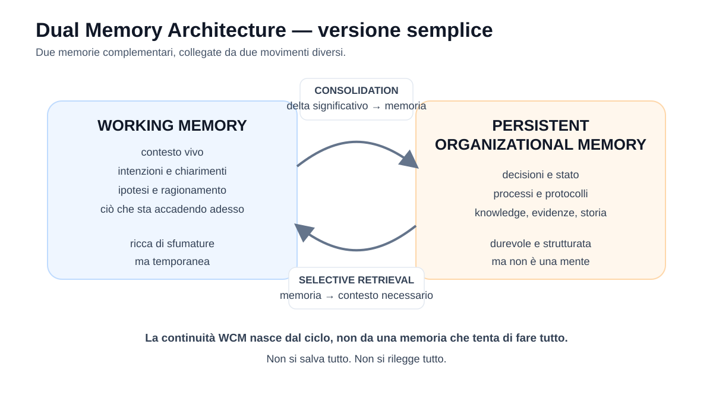
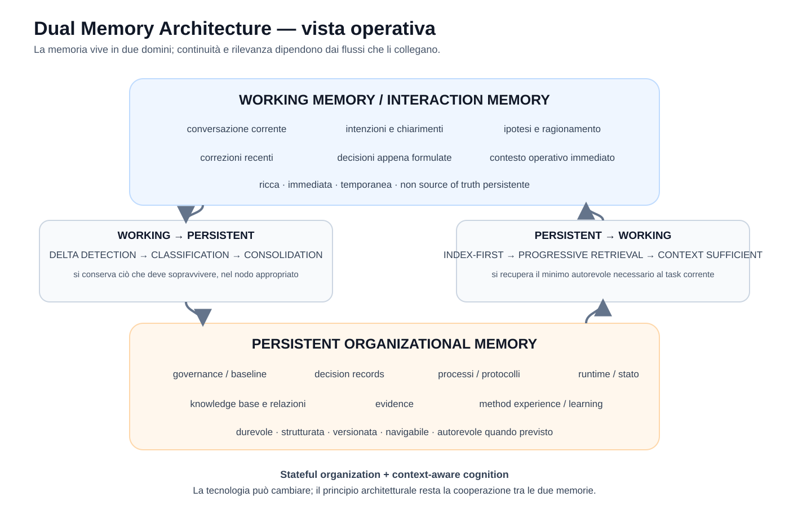

# Capitolo 03 — Perché una sola memoria non basta

**Stato:** FROZEN  
**Blocco:** 1 — Fondamenti + Dual Memory  
**Scope:** WCM generale / domain-agnostic  
**Technical Review:** PASS — 2026-08-25  
**Human Comprehension Review:** PASS — 2026-08-25

---

## 3.0 Prima di parlare di due memorie

Nel primo capitolo abbiamo visto che una conversazione intelligente non è, da sola, un'organizzazione. Nel secondo abbiamo costruito il vocabolario minimo per parlare con precisione di stato, authority, processi, protocolli, nodi, indici e affidabilità.

Ora possiamo affrontare uno dei principi più importanti del WCM: la **Dual Memory Architecture**.

Il nome può far pensare a qualcosa di complesso: due database, due sistemi separati, due copie delle stesse informazioni. Non è questo.

La Dual Memory nasce da una constatazione molto semplice:

> **per lavorare bene nel tempo, un sistema AI ha bisogno sia del contesto vivo del momento sia di una memoria organizzativa che sopravviva al momento.**

Queste due esigenze sono diverse.

Il contesto vivo serve per comprendere sfumature, intenzioni, correzioni, ragionamenti e ciò che sta accadendo adesso.

La memoria organizzativa serve per conservare ciò che deve restare valido, ricostruibile e utilizzabile anche dopo che quella conversazione è terminata.

Se proviamo a usare una sola delle due per fare tutto, incontriamo problemi opposti.

Ed è precisamente da questi due limiti che parte il WCM.

---

# 3.1 Il limite della memoria conversazionale

## Una memoria ricca, ma legata al presente

Durante una conversazione, un sistema AI può possedere un contesto molto ricco.

Può conoscere:

- ciò che abbiamo appena detto;
- una correzione formulata pochi minuti prima;
- il tono con cui una richiesta è stata espressa;
- una distinzione che non è ancora stata trasformata in un documento;
- un dubbio ancora aperto;
- una proposta che stiamo valutando;
- una decisione appena presa;
- le ragioni che hanno portato a quella decisione.

Questa ricchezza è preziosa perché il significato di una frase dipende spesso da ciò che è avvenuto immediatamente prima.

Immaginiamo, per esempio, questa sequenza:

> «La soluzione A sembra la più semplice.»  
> «Aspetta, c'è un vincolo che non avevamo considerato.»  
> «Hai ragione. Allora A non va più bene.»  
> «Decidiamo B.»

Una memoria viva che comprende l'intera sequenza coglie facilmente il senso: A era una possibilità, poi è emerso un vincolo, e infine B è diventata la scelta.

Se leggessimo soltanto una frase isolata, potremmo perdere quella evoluzione.

Questa è la forza della **Working Memory**, che nel WCM indica il contesto cognitivo vivo disponibile durante il lavoro corrente.

Ma la stessa Working Memory ha un limite fondamentale: **non è una fonte organizzativa persistente sufficiente**.

Una conversazione può finire. Il contesto disponibile può cambiare. Una nuova sessione può iniziare con meno informazioni. Un altro componente può dover proseguire il lavoro. Un sistema o un modello diverso può essere chiamato in causa. Una decisione importante può dover essere verificata mesi dopo.

In tutti questi casi non possiamo basare l'organizzazione sulla speranza che il contesto vivo sia ancora identico a quello originario.

### Il problema non è soltanto “dimenticare”

Quando si parla di memoria dell'AI, si pensa spesso a un problema quantitativo:

> «Come facciamo a farle ricordare più cose?»

Per il WCM la domanda è diversa.

Anche una memoria conversazionale molto ampia non risolve automaticamente problemi come:

- quale informazione è una decisione e quale era soltanto un'ipotesi;
- quale versione è ancora valida;
- chi aveva authority per decidere;
- cosa è stato successivamente sostituito;
- quali processi si applicavano;
- quale workflow era ancora aperto;
- da quale fonte deriva un'informazione;
- quali altre parti del sistema dipendono da quella scelta.

Quindi **più contesto non equivale automaticamente a più memoria organizzativa**.

Una conversazione lunga può contenere molta conoscenza e contemporaneamente essere una cattiva source of truth.

---

## Il primo anti-pattern: “la chat ricorderà tutto”

Un'organizzazione costruita implicitamente così:

```text
CONVERSAZIONE
     ↓
TUTTO IL CONTESTO RESTA DISPONIBILE
     ↓
L'AI RICORDERÀ COSA FARE
```

è fragile.

Funziona finché la continuità della sessione coincide con la continuità del lavoro.

Ma WCM assume esattamente il contrario:

```text
FINE SESSIONE ≠ FINE LAVORO
```

Il lavoro deve poter sopravvivere alla sessione.

Ciò che è materiale deve quindi poter essere ricostruito anche senza possedere integralmente la conversazione che lo ha generato.

---

# 3.2 Il limite opposto: una repository non è una mente

A questo punto potremmo pensare che la soluzione sia semplice:

> «Allora salviamo tutto in una memoria persistente e, ogni volta, rileggiamo quella.»

Anche questo estremo è sbagliato.

Nel linguaggio tecnico si usa spesso la parola **repository**: qui possiamo intenderla semplicemente come uno spazio persistente e versionato nel quale vengono conservati file e la loro storia nel tempo. È uno degli strumenti possibili per implementare parti della memoria organizzativa, non la memoria stessa.

Una memoria persistente ha qualità che la Working Memory non possiede.

Può essere:

- durevole;
- strutturata;
- versionata;
- verificabile;
- condivisibile tra sessioni o componenti;
- dotata, quando previsto, di authority e provenance;
- organizzata in nodi e relazioni;
- navigabile attraverso entry point e indici.

Ma non per questo diventa una mente.

Un archivio, una knowledge base o una repository possono contenere moltissime informazioni senza sapere automaticamente:

- quali servono adesso;
- quale sfumatura della conversazione corrente è importante;
- se una frase appena pronunciata è una proposta o una decisione;
- quale problema stiamo cercando realmente di risolvere;
- quale pezzo della memoria deve essere richiamato in questo preciso momento;
- quando il contesto già disponibile è sufficiente e non serve leggere altro.

Questa è una distinzione fondamentale.

> **La memoria persistente conserva e struttura conoscenza. Non sostituisce l'atto cognitivo di interpretare il contesto corrente.**

---

## Il secondo anti-pattern: “per sicurezza rileggiamo tutto”

Una possibile reazione alla perdita di memoria conversazionale è costruire un sistema che, a ogni richiesta, carica l'intero patrimonio persistente.

Schema:

```text
NUOVA RICHIESTA
      ↓
LEGGI TUTTA LA REPOSITORY
      ↓
CARICA TUTTA LA KNOWLEDGE BASE
      ↓
PROVA A RICOSTRUIRE IL CONTESTO
```

Sembra prudente. In realtà crea nuovi rischi.

Più informazioni leggiamo, più aumentano le probabilità di incontrare:

- documenti storici non più correnti;
- versioni già sostituite da versioni successive;
- concept non approvati;
- evidenze che spiegano il passato ma non rappresentano la **baseline attiva**, cioè l'insieme corrente di regole, decisioni e riferimenti considerati validi per quel contesto;
- informazioni irrilevanti per il task;
- contraddizioni apparenti;
- costi e latenza inutili.

Il WCM considera quindi un anti-pattern anche la strategia:

> **«Per sicurezza leggo tutto.»**

Una memoria ben costruita non deve soltanto conservare informazioni. Deve permettere di **raggiungere quelle giuste senza attraversare indiscriminatamente tutte le altre**.

Da qui nasce l'architettura INDEX-FIRST, che approfondiremo più avanti.

---

# 3.3 Perché WCM non sceglie tra le due

A questo punto abbiamo due memorie con qualità quasi opposte.

### Working Memory

È:

- viva;
- immediata;
- ricca di sfumature;
- vicina all'intenzione corrente;
- utile per ragionare.

Ma è anche:

- temporanea;
- dipendente dal contesto disponibile;
- non sufficiente come source of truth organizzativa;
- inadatta, da sola, a garantire continuità e ricostruzione verificabile della storia.

### Persistent Organizational Memory

È:

- durevole;
- strutturata;
- versionata;
- navigabile;
- trasferibile;
- adatta a conservare stato, decisioni, regole e storia con il relativo status e livello di authority.

Essere persistente, però, **non rende automaticamente ogni contenuto autorevole**: una memoria organizzativa può contenere anche ipotesi, evidence, concept aperti, versioni superseded e storico. Status e source precedence restano essenziali.

La Persistent Organizational Memory è inoltre:

- meno ricca della conversazione viva;
- necessariamente selettiva;
- incapace, da sola, di interpretare ogni nuova situazione;
- inutile se il sistema non sa cosa recuperare e quando.

Il WCM non cerca di stabilire quale delle due sia “migliore”.

La domanda corretta è:

> **Come facciamo a farle cooperare senza confonderne i ruoli?**

È questa la Dual Memory Architecture.

---

# 3.4 Il principio della Dual Memory

La Dual Memory WCM è composta da due livelli complementari.

## Working Memory / Interaction Memory

È il contesto vivo del lavoro cognitivo corrente.

Contiene, quando disponibili:

- conversazione attuale;
- chiarimenti recenti;
- intenzioni;
- ipotesi;
- ragionamenti;
- correzioni;
- decisioni appena formulate ma non necessariamente ancora consolidate;
- contesto operativo immediato.

Non è la source of truth persistente.

## Persistent Organizational Memory

È la conoscenza che deve sopravvivere alla singola sessione e diventare organizzativamente utilizzabile.

Può contenere, secondo la natura del lavoro:

- governance e baseline;
- decisioni;
- processi e protocolli;
- stato e workflow persistenti;
- knowledge base;
- relazioni tra nodi;
- evidenze;
- learning e storia delle modifiche.

Non è una copia della conversazione.

---

## FIG-001A — Dual Memory, versione semplice



La figura contiene già due parole centrali: **consolidation** e **selective retrieval**.

Sono i due movimenti che tengono unite le memorie.

---

## Movimento 1 — Working → Persistent: consolidare

La Working Memory produce continuamente contenuti.

Ma non tutto ciò che viene detto deve diventare memoria organizzativa.

Una conversazione può contenere:

- riflessioni temporanee;
- tentativi;
- idee scartate;
- domande;
- ipotesi;
- decisioni;
- fatti nuovi;
- requisiti;
- evidenze;
- cambi di stato.

Il WCM deve quindi individuare il **delta significativo**, cioè ciò che è realmente cambiato rispetto alla memoria persistente e merita di sopravvivere.

Poi deve classificarlo.

Per esempio:

```text
“Potremmo fare X”
→ proposta

“Ho deciso X”
→ decisione

“L'attività è completata”
→ possibile cambio di stato, da verificare

“Il test ha prodotto questo risultato”
→ evidenza
```

Solo dopo questa classificazione il contenuto appropriato viene consolidato nel nodo persistente corretto.

Questa disciplina evita un errore comune:

```text
CHAT
 ↓
COPIA TUTTO
 ↓
MEMORIA
```

Il WCM preferisce:

```text
INTERAZIONE
 ↓
DELTA DETECTION
 ↓
CLASSIFICATION
 ↓
CONSOLIDATION
 ↓
PERSISTENT TARGET APPROPRIATO
```

---

## Movimento 2 — Persistent → Working: recuperare selettivamente

Il movimento opposto avviene quando il sistema ha bisogno di contesto che non è già disponibile o deve verificare authority, stato o baseline.

Anche qui WCM evita l'approccio massivo.

Non:

```text
NUOVO TASK
→ LEGGI TUTTO
```

ma:

```text
NUOVO TASK
→ COSA SO GIÀ?
→ COSA MI MANCA?
→ DOVE SI TROVA LA FONTE PIÙ AUTOREVOLE?
→ RECUPERA IL MINIMO NECESSARIO
→ STOP QUANDO IL CONTESTO È SUFFICIENTE
```

Questo è il principio di **selective retrieval**.

Il retrieval è quindi **context-aware**: tiene conto del contesto vivo già disponibile e usa la memoria persistente per completare o verificare ciò che serve.

---

# 3.5 Stateful organization + context-aware cognition

La sintesi architetturale della Dual Memory può essere espressa con una formula:

> **stateful organization + context-aware cognition**

Vediamola senza dare nulla per scontato.

## Stateful organization

“Stateful” significa che l'organizzazione conserva uno stato tra una esecuzione e la successiva.

In altre parole, il sistema non riparte ogni volta come se nulla fosse accaduto.

Può ricostruire, quando necessario:

- cosa è stato deciso;
- quale stato è corrente;
- quali workflow sono aperti;
- quali elementi sono stati sostituiti;
- quali authority sono valide;
- quali regole si applicano;
- quali evidenze sono state raccolte.

Questa continuità appartiene alla **Persistent Organizational Memory**.

## Context-aware cognition

“Context-aware” significa invece che il nucleo cognitivo non ignora ciò che sta accadendo adesso.

Se la conversazione corrente contiene già un chiarimento appena espresso, non ha senso rileggerlo da un documento solo per rituale.

Se però il task dipende da una decisione frozen, da uno stato operativo o da una authority che potrebbe essere cambiata, la memoria persistente deve essere verificata.

Il comportamento corretto è quindi dinamico:

```text
CONTESTO CORRENTE SUFFICIENTE E NON SENSIBILE?
   ├─ SÌ → usa ciò che è già disponibile
   └─ NO / SERVE VERIFICA AUTOREVOLE
             ↓
       RETRIEVAL PERSISTENTE
```

Questo evita i due estremi:

```text
“L'AI deve ricordare tutto da sola”
```

oppure:

```text
“L'AI deve ignorare ciò che sa e rileggere sempre tutto.”
```

---

# 3.6 FIG-001B — La Dual Memory come architettura operativa



Questa rappresentazione chiarisce una cosa importante: le due memorie non sono semplicemente due “contenitori”.

Sono collegate da **processi di trasformazione e navigazione**.

Nel percorso verso la memoria persistente, WCM deve capire cosa vale la pena conservare e in quale forma.

Nel percorso verso la memoria viva, WCM deve capire cosa manca e quale fonte recuperare.

La qualità della Dual Memory dipende quindi non soltanto dai contenuti presenti, ma anche dalla qualità di questi due flussi.

---

# 3.7 Un esempio completo, senza tecnologia

Immaginiamo un'organizzazione che sta definendo una nuova politica commerciale.

Durante una riunione emerge questa sequenza:

1. qualcuno propone uno sconto del 20%;
2. viene evidenziato che il margine non lo consente;
3. si valuta uno sconto del 10%;
4. il responsabile autorizzato decide definitivamente il 10%;
5. viene stabilito che la nuova regola entrerà in vigore dal mese successivo.

La **Working Memory** contiene l'intera conversazione e permette di capire come si è arrivati alla decisione.

Ma la memoria organizzativa non ha bisogno di conservare ogni frase come se avesse lo stesso valore.

Il consolidamento dovrebbe preservare almeno ciò che conta:

- decisione: sconto massimo 10%;
- authority: chi ha deciso;
- data/efficacia;
- eventuale decisione precedente sostituita;
- documenti o processi influenzati.

Qualche settimana dopo una persona chiede:

> «Qual è lo sconto massimo che possiamo applicare?»

Il sistema non deve ricostruire l'intera riunione.

Deve raggiungere la fonte corrente autorevole e recuperare il dato necessario.

Se invece la domanda è:

> «Perché siamo passati dal 20% al 10%?»

potrebbe servire anche una parte della storia o dell'evidenza che ha motivato la decisione.

Lo stesso patrimonio persistente viene quindi interrogato **in modo diverso a seconda del task**.

Questo è il valore del retrieval selettivo.

---

# 3.8 La Dual Memory non è una duplicazione

È utile chiarire alcuni equivoci.

### Non significa avere due copie di tutto

Working Memory e Persistent Organizational Memory non devono contenere necessariamente le stesse informazioni.

La prima può contenere dettagli temporanei utili solo al ragionamento corrente.

La seconda conserva ciò che deve sopravvivere.

### Non significa salvare automaticamente ogni conversazione

Il WCM salva il **delta rilevante**, non la trascrizione indiscriminata del dialogo.

### Non significa rileggere sempre la repository

Se il contesto corrente è sufficiente e non serve verificare authority o stato persistente, una rilettura ridondante aggiunge costo senza valore.

### Non significa che la memoria persistente sia sempre “più vera” di qualunque cosa venga detta

Una nuova decisione autorizzata può cambiare la baseline persistente.

Ma prima deve essere riconosciuta come decisione, collegata alla authority e propagata correttamente. Una semplice proposta non sovrascrive ciò che è già attivo.

### Non crea una terza memoria

Viste derivate, read model o rappresentazioni dello stato possono esistere per rendere l'informazione leggibile o operativa, ma non costituiscono automaticamente una terza memoria semantica. Se sono rigenerabili da una fonte autorevole, sono proiezioni della memoria o dello stato, non un nuovo livello cognitivo indipendente.

---

# 3.9 Perché questo approccio è importante per un sistema AI

La Dual Memory affronta contemporaneamente due problemi che spesso vengono trattati separatamente.

Il primo è il problema della **continuità**:

> come fa il sistema a sapere cosa è successo prima?

Il secondo è il problema della **rilevanza**:

> come fa il sistema a non essere sommerso da tutto ciò che è successo prima?

La memoria persistente risponde soprattutto al primo.

Il retrieval selettivo e la Working Memory rispondono soprattutto al secondo.

Il risultato desiderato non è quindi “ricordare tutto”.

È:

> **ricordare ciò che deve sopravvivere e recuperare ciò che serve quando serve.**

Questa combinazione riduce la dipendenza dalla memoria di una singola sessione senza trasformare ogni nuova richiesta in una rilettura dell'intera organizzazione.

---

# 3.10 Principio stabile e implementazione evolutiva

È importante distinguere il principio architetturale dalla tecnologia con cui viene realizzato.

Il WCM ha congelato come baseline il principio della Dual Memory:

- Working Memory e Persistent Organizational Memory sono complementari;
- il consolidamento deve essere selettivo;
- il retrieval deve essere progressivo e contestuale;
- le decisioni materiali devono preservare authority, storia e impatti.

La tecnologia concreta può invece evolvere.

Oggi una memoria persistente può essere implementata attraverso repository versionate, file strutturati, knowledge base, registri, runtime e altri componenti.

In futuro alcune tecnologie potrebbero cambiare senza modificare il principio.

Questa distinzione evita un errore importante:

> confondere **l'architettura** con **uno specifico strumento utilizzato per implementarla**.

---

# 3.11 Dove siamo arrivati

Possiamo ora sintetizzare il capitolo in cinque affermazioni.

1. La memoria conversazionale è semanticamente ricca ma non garantisce, da sola, continuità organizzativa.
2. La memoria persistente è durevole e strutturata ma non è una mente e non deve essere riletta integralmente a ogni richiesta.
3. WCM utilizza entrambe attraverso una Dual Memory Architecture.
4. Il collegamento tra le due avviene tramite **consolidation** e **selective retrieval**.
5. Il risultato desiderato è una **stateful organization con context-aware cognition**.

Nei prossimi tre capitoli apriremo questa architettura pezzo per pezzo:

- Capitolo 4: Working Memory;
- Capitolo 5: Persistent Organizational Memory;
- Capitolo 6: il ciclo di consolidamento e retrieval tra le due.

---

# Source Map — Frozen 03

Fonti canoniche principali verificate per questa versione:

- `wcm/kb/decisions/DEC-004_DUAL_MEMORY_CAUSAL_DECISION_BASELINE.md` — principio Dual Memory FROZEN e separazione tra architettura e implementazione;
- `wcm/kb/concepts/CONCEPT-008_DUAL_MEMORY_COGNITIVE_CONTINUITY.md` — Working Memory, Persistent Organizational Memory, complementarità, retrieval context-aware e consolidation;
- `wcm/kb/concepts/CONCEPT-007_AGENT_READY_KNOWLEDGE_ARCHITECTURE.md` — navigation layer, index-first e progressive retrieval;
- `wcm/process-book/processes/PROC-005_AGENT_READY_CONTEXT_BOOTSTRAP.md` — uso del contesto vivo + retrieval persistente minimo;
- `wcm/process-book/processes/PROC-006_MEMORY_CONSOLIDATION_LOOP.md` — delta detection, classification, Impact Set e consolidation;
- `wcm/process-book/protocols/PROT-005_INDEX_FIRST_PROGRESSIVE_RETRIEVAL.md` — stop when sufficient e anti-pattern del full reload.

## Figure collegate

- `FIG-001A_DUAL_MEMORY_SIMPLE.svg` — APPROVED / EMBEDDED;
- `FIG-001B_DUAL_MEMORY_ARCHITECTURE.svg` — APPROVED / EMBEDDED.

## Review closure

- `reviews/CH03_TECHNICAL_REVIEW.md` — PASS;
- `reviews/CH03_HUMAN_COMPREHENSION_REVIEW.md` — PASS;
- FIG-001A / FIG-001B technical consistency — PASS;
- FIG-001A / FIG-001B readability — PASS;
- scope check — PASS;
- nessun riferimento project-specific nel capitolo.

**Freeze verdict:** `CHAPTER 03 FROZEN — 2026-08-25`.
