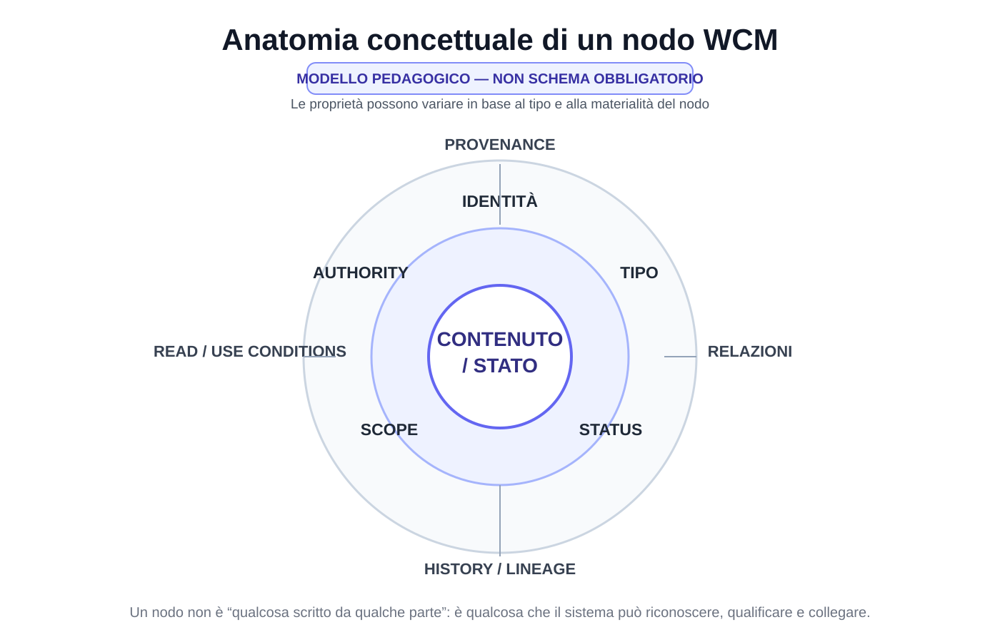

# Capitolo 07 — L'architettura a nodi

**Stato:** FROZEN  
**Blocco:** 2 — Knowledge Architecture  
**Scope:** WCM generale / domain-agnostic  
**Review:** Technical Review PASS / Human Comprehension Review PASS

---

## 7.0 Da una raccolta di documenti a una memoria organizzata

Nel capitolo precedente abbiamo chiuso il ciclo della Dual Memory.

Abbiamo visto come un contenuto nasce nella Working Memory, viene riconosciuto come delta, classificato, consolidato nella Persistent Organizational Memory e, quando serve, recuperato selettivamente per tornare nel contesto vivo.

A questo punto emerge una domanda inevitabile:

> **Che forma deve avere la memoria persistente perché tutto questo sia davvero possibile?**

La risposta più semplice sarebbe:

> “Una buona struttura di cartelle e file.”

È certamente utile.

Ma non basta.

Una cartella può dirci **dove** si trova un documento.

Non ci dice necessariamente:

- che cosa rappresenta quel documento;
- se è corrente o storico;
- se è una decisione, un processo, un'evidence o una semplice nota;
- chi possiede authority su quel contenuto;
- da cosa dipende;
- cosa potrebbe essere influenzato se cambia;
- se è stato sostituito;
- se deve essere letto durante un certo task;
- se il suo contenuto è una fonte primaria o una proiezione derivata.

Per questo WCM non concepisce la Persistent Organizational Memory soltanto come un file system.

La concepisce progressivamente come una **rete di nodi identificabili**.

Un nodo è un oggetto persistente che possiede un significato organizzativo riconoscibile.

Può essere un documento.

Ma può essere anche:

- una decisione;
- un processo;
- un protocollo;
- uno stato;
- un workflow checkpoint;
- un requisito;
- un'evidence;
- un output approvato;
- un learning;
- un registro;
- un'entità o un altro oggetto persistente rilevante.

Questo capitolo spiega che cosa significa.

---

# 7.1 Perché il file system da solo non basta

Immaginiamo una biblioteca perfettamente ordinata.

Ogni libro è nella sua sezione.

Ogni sezione ha un nome chiaro.

I libri sono conservati bene.

Ma supponiamo che manchino:

- il catalogo;
- l'indicazione dell'edizione corrente;
- le relazioni tra un volume e quello che lo sostituisce;
- la distinzione tra manuale, bozza, archivio e normativa;
- l'informazione su quale testo sia ufficiale.

La biblioteca sarebbe ordinata fisicamente, ma non necessariamente **navigabile semanticamente**.

Un file system funziona in modo simile.

Può organizzare bene:

```text
/cartella
    /sottocartella
        file.md
```

ma la posizione del file non basta a descriverne il ruolo.

Consideriamo due file:

```text
decisione-prezzi.md
decisione-prezzi-v2.md
```

Qual è corrente?

La seconda?

Forse.

Ma un nome più recente non è una prova di authority.

Potrebbe essere una bozza.

Oppure una copia.

Oppure una proposta mai approvata.

Il problema non è quindi soltanto **storage**.

È **significato**.

WCM deve poter riconoscere che cosa rappresenta un oggetto persistente e quale ruolo svolge nel sistema.

È qui che entra il concetto di nodo.

---

# 7.2 Che cos'è un nodo

La definizione operativa usata nella baseline WCM è semplice:

> **Un nodo è qualsiasi oggetto persistente materialmente rilevante per il reasoning o per l'esecuzione.**

La parola *oggetto* è intenzionalmente ampia.

Un nodo non deve essere necessariamente:

- una pagina;
- un file Markdown;
- una riga di database;
- un record JSON;
- una scheda grafica.

Questi sono modi possibili di rappresentarlo.

Il nodo è prima di tutto una **unità logica di conoscenza o di stato**.

Per esempio:

```text
DECISIONE
"Adottiamo la policy X"
```

è un nodo logico.

Può essere rappresentato in un file dedicato.

Oppure all'interno di un registro.

Ma ciò che conta è che abbia identità, status e significato sufficientemente chiari da poter essere ritrovato e collegato.

Un'altra definizione utile è:

> **Un nodo è qualcosa a cui il WCM deve poter fare riferimento senza dover ogni volta ricostruirne il significato da zero.**

---

# 7.3 Nodo non significa “ogni file”

Questa distinzione è importante.

Se dicessimo:

```text
FILE = NODO
```

trasformeremmo una convenzione tecnica in una legge architetturale.

WCM non lo fa.

Un file può essere un nodo molto naturale quando rappresenta un oggetto materialmente significativo.

Esempio:

```text
DEC-004_DUAL_MEMORY_CAUSAL_DECISION_BASELINE.md
```

è contemporaneamente:

- un file;
- una decisione persistente;
- un oggetto con ID;
- un nodo collegabile ad altri nodi.

Ma un file potrebbe anche essere:

- un'immagine derivata;
- una copia temporanea;
- un asset;
- una cache;
- un artefatto di build;
- un frammento tecnico senza significato organizzativo autonomo.

Non avrebbe senso trasformare automaticamente tutto in nodi cognitivi.

Allo stesso modo, un singolo file potrebbe contenere più oggetti logici.

Il principio WCM è quindi:

> **La nodalità deriva dalla funzione organizzativa, non dall'estensione del file.**

---

# 7.4 Perché l'identità è importante

Per collegare un oggetto nel tempo serve poterlo identificare.

Immaginiamo una decisione chiamata semplicemente:

> “Scelta architetturale”

Se esistono dieci documenti con titoli simili, i riferimenti diventano fragili.

WCM preferisce quindi, quando appropriato, identità stabili come:

```text
DEC-004
PROC-006
PROT-013
WCM-LRN-004
```

L'ID non rende il contenuto più vero.

Rende il contenuto **riferibile**.

Questo è fondamentale per poter scrivere relazioni come:

```text
PROC-006
DEPENDS_ON → DEC-004
```

senza dover dire:

> “quel documento sulla memoria che avevamo scritto qualche giorno fa”.

Una buona identità consente:

- riferimenti stabili;
- lineage;
- dependency tracking;
- retrieval;
- audit;
- aggiornamenti;
- automazioni deterministiche.

Un ID formale e stabile è particolarmente utile quando il nodo deve essere richiamato, collegato o governato nel tempo. Questo non implica però che ogni elemento storico debba essere riconvertito retroattivamente in un record con ID formale: la struttura si applica in modo proporzionato ai nodi attivi e materialmente rilevanti.

---

# 7.5 Documento come nodo

Il documento è probabilmente il tipo di nodo più intuitivo.

Un documento può rappresentare:

- una specifica;
- una guida;
- una baseline;
- un contratto;
- un manuale;
- una decisione;
- un concept;
- un registro;
- un report.

Ma nel WCM il valore del documento non deriva soltanto dal suo testo.

Deriva anche dal suo **ruolo nella memoria**.

Un documento utile dovrebbe rendere riconoscibile, quando pertinente:

- ID;
- tipo;
- status;
- scope;
- owner;
- authority;
- condizioni di lettura;
- dipendenze;
- eventuale supersession;
- evidence.

`CONCEPT-007 Agent-Ready Knowledge Architecture` propone, quando utili, metadati come:

```yaml
DOCUMENT_ID:
TYPE:
STATUS:
SCOPE:
OWNER:
READ_WHEN:
AUTHORITY:
DEPENDS_ON:
SUPERSEDES:
EVIDENCE:
```

Questa non è una regola che obbliga ogni documento storico a possedere immediatamente tutti i campi.

È una direzione architetturale.

L'obiettivo è rendere i nodi **riconoscibili da umani e agenti**.

---

# 7.6 Decisione come nodo

Una decisione materiale è uno degli esempi più importanti.

WCM la considera un **nodo causale**.

Questo significa che una decisione non è soltanto:

> “una frase che descrive ciò che abbiamo scelto”.

Può generare effetti.

Per esempio:

```text
DECISIONE
        ↓
   ┌────┼─────┐
   ↓    ↓     ↓
REQUISITO  PROCESSO  DOCUMENTO
```

`CONCEPT-009 Decision Lineage & Causal Impact` stabilisce che una decisione significativa deve poter conservare, in modo proporzionato:

- decisione corrente;
- authority;
- data;
- rationale;
- decisione precedente;
- dipendenze;
- elementi influenzati;
- revisit trigger.

Il template WCM di Decision Record include campi come:

```text
DECISION_ID
STATUS
SCOPE
AUTHORITY
DEPENDS_ON
AFFECTS
SUPERSEDES
SUPERSEDED_BY
EVIDENCE_REFERENCES
```

Questo trasforma una decisione da testo isolato a nodo governato.

---

# 7.7 Processo come nodo

Anche un processo è un nodo.

Perché?

Perché può essere:

- identificato;
- richiamato;
- applicato;
- aggiornato;
- collegato a decisioni;
- vincolato da protocolli;
- verificato tramite evidence.

Esempio:

```text
PROC-006
Memory Consolidation & Consistency Loop
```

non è soltanto un documento da leggere.

È un oggetto procedurale che può essere chiamato quando un certo trigger si verifica.

Possiede:

- ID;
- scopo;
- trigger;
- input;
- passi;
- output;
- failure mode;
- relazioni con altri nodi.

Quando una richiesta richiede consolidamento, WCM può fare riferimento al nodo `PROC-006`.

Questa capacità è molto diversa dal semplice:

> “Cerca nella cartella dei processi qualcosa che sembra adatto.”

---

# 7.8 Protocollo come nodo

Un protocollo è anch'esso un nodo, ma svolge una funzione diversa dal processo.

Un protocollo può imporre una regola trasversale.

Per esempio:

```text
PROT-005
Index-First Progressive Retrieval
```

può vincolare più attività diverse.

Il valore della sua identità nodale è che può essere collegato a:

- processi che lo richiedono;
- operazioni che lo attivano;
- failure che previene;
- decisioni che lo autorizzano;
- evidence che ne supporta l'evoluzione.

Un processo descrive **come si svolge un flusso**.

Un protocollo descrive **quale regola deve essere rispettata quando il suo perimetro è applicabile**.

Entrambi diventano nodi perché devono essere richiamabili in modo stabile.

---

# 7.9 Evidence come nodo

L'evidence è un nodo delicato perché non deve essere confusa con authority.

Un test può dimostrare che qualcosa è accaduto.

Una telemetria può mostrare un failure.

Un risultato può supportare un learning.

Ma un'evidence non diventa automaticamente una decisione.

Rappresentarla come nodo permette di conservare:

- cosa è stato osservato;
- quando;
- con quale metodo;
- quale conclusione supporta;
- quali limiti possiede;
- quali learning o decisioni ne derivano.

Possiamo avere:

```text
EVIDENCE-17
      ↓ EVIDENCE_FOR
LEARNING-04
```

e successivamente:

```text
LEARNING-04
      ↓ DERIVED_FROM
EVIDENCE-17
```

senza trasformare automaticamente l'evidence in baseline.

---

# 7.10 Stato come nodo

Lo stato è un altro tipo di nodo fondamentale.

Perché una futura sessione deve poter sapere:

> **Dove siamo?**

Uno stato può rappresentare:

- stato di progetto;
- stato di workflow;
- stato di un gate;
- stato di un documento;
- stato di Knowledge Health.

Nel WCM corrente alcuni stati sono rappresentati in strutture machine-readable, non soltanto in prosa.

Per esempio, un workflow persistente può avere proprietà come:

```text
STATUS
LAST_COMPLETED_TRANSITION
NEXT_TRANSITION
TRUE_STOP_CONDITION
RESUME_REQUIRED
```

Questo nodo di stato deve essere distinto da una descrizione human-facing.

Il fatto che una dashboard mostri:

> “In attesa di approvazione”

non significa che la dashboard stessa sia l'execution master.

La nodalità aiuta anche qui a distinguere:

```text
STATO AUTOREVOLE
```

da:

```text
PROIEZIONE DELLO STATO
```

---

# 7.11 Output come nodo

Quando un output diventa approvato, frozen o locked, può diventare un nodo persistente importante.

Per esempio:

- una specifica approvata;
- una baseline;
- un capitolo frozen;
- un dataset validato;
- un artefatto finale.

La sua identità permette di collegare:

- la fonte da cui deriva;
- l'authority che lo ha approvato;
- il workflow che lo ha prodotto;
- la versione;
- i documenti che lo utilizzano;
- eventuali successori.

Questo è particolarmente importante quando esistono molte versioni.

```text
OUTPUT V1
STATUS = SUPERSEDED

OUTPUT V2
STATUS = FROZEN
SUPERSEDES → OUTPUT V1
```

La storia resta ricostruibile senza confondere ciò che è corrente con ciò che appartiene al passato.

---

# 7.12 Learning come nodo

La Method Experience Memory tratta anche il learning come oggetto persistente identificabile.

Un learning può trovarsi in stati come:

- CANDIDATE;
- OBSERVING;
- VALIDATED;
- REJECTED;
- SUPERSEDED;
- PROMOTED.

Questo è un ottimo esempio del valore della nodalità.

Se il learning fosse soltanto una frase dispersa dentro un diario, sarebbe difficile sapere:

- se è ancora valido;
- da quale evidence deriva;
- se ha prodotto una modifica del metodo;
- se è stato smentito;
- se è stato superseded.

Come nodo, invece, può avere vita propria nella rete della conoscenza.

---

# 7.13 L'anatomia minima di un nodo

Non tutti i nodi devono avere la stessa struttura.

Un workflow checkpoint e una decisione hanno esigenze diverse.

Tuttavia, per capire la logica, possiamo descrivere una **anatomia concettuale minima**.

> Questa è una rappresentazione pedagogica, non un nuovo schema obbligatorio del WCM.

Un nodo utile tende ad avere:

```text
IDENTITÀ
Che cosa è?

TIPO
Decisione? Processo? Evidence? Stato?

STATUS
Corrente? Draft? Frozen? Superseded?

SCOPE
Dove vale?

OWNER / AUTHORITY
Chi lo governa? Chi può modificarlo?

CONTENUTO / STATE
Che cosa afferma o rappresenta?

PROVENANCE
Da dove deriva?

RELATIONS
Da cosa dipende? Cosa influenza?

HISTORY
Che cosa sostituisce? Che cosa lo sostituisce?

READ / USE CONDITIONS
Quando è pertinente?
```

Più il nodo è materialmente importante, più alcune di queste proprietà diventano preziose.

---

# 7.14 FIG-003 — Anatomia concettuale di un nodo WCM



La figura è esplicitamente un **modello pedagogico** e non definisce uno schema tecnico universale.

Mostra piuttosto le domande che un nodo importante dovrebbe permettere di risolvere.

Il centro contiene il **contenuto o lo stato**.

Intorno troviamo:

- identità;
- tipo;
- status;
- scope;
- authority;
- provenance;
- relazioni;
- storia.

Il messaggio è:

> **Un nodo non è soltanto “qualcosa scritto da qualche parte”. È qualcosa che il sistema può riconoscere, qualificare e collegare.**

---

# 7.15 Identity, Type, Status, Scope e Authority

Cinque proprietà meritano particolare attenzione.

## Identity

Risponde:

> “Di quale oggetto stiamo parlando?”

Esempio:

```text
PROT-013
```

## Type

Risponde:

> “Che tipo di oggetto è?”

Esempio:

```text
TYPE = PROTOCOL
```

## Status

Risponde:

> “In quale stato si trova?”

Esempi:

```text
ACTIVE
FROZEN
DRAFT
SUPERSEDED
VALIDATED
```

Lo stesso contenuto può avere significato diverso a seconda dello status.

## Scope

Risponde:

> “Dove vale?”

Una regola può essere:

- WCM generale;
- specifica di un progetto;
- limitata a un workflow;
- legata a un particolare componente.

## Authority

Risponde:

> “Chi può produrre o modificare questo effetto?”

Questa proprietà evita un equivoco fondamentale:

> **avere accesso al nodo non significa avere authority sul nodo.**

---

# 7.16 Provenance: sapere da dove viene

La provenance risponde alla domanda:

> **Perché questo nodo esiste e da dove deriva?**

Può includere:

- decisione che lo ha autorizzato;
- evidence da cui deriva;
- workflow che lo ha prodotto;
- fonte owner;
- versione precedente;
- commit o source SHA;
- processo che lo ha generato.

La provenance permette di distinguere:

```text
“questo contenuto esiste”
```

da:

```text
“questo contenuto è ricostruibile e verificabile”
```

Una memoria senza provenance può ricordare il risultato ma perdere la catena che lo rende affidabile.

---

# 7.17 History e lineage

Un nodo può cambiare.

Ma WCM cerca di evitare la cancellazione silenziosa della storia.

Questo vale soprattutto per decisioni e baseline materiali.

Il pattern è:

```text
NODO X
STATUS = SUPERSEDED
SUPERSEDED_BY → NODO Y

NODO Y
STATUS = ACTIVE / FROZEN
SUPERSEDES → NODO X
```

Questo collegamento storico è il **lineage**.

Il lineage consente di sapere:

- cosa vale oggi;
- cosa valeva prima;
- quando è avvenuto il cambio;
- quale elemento ha sostituito quale;
- perché alcuni output storici riflettono una baseline diversa.

---

# 7.18 Il valore delle relazioni

Finora abbiamo parlato dei nodi quasi isolatamente.

Ma un nodo acquisisce gran parte del proprio valore quando è collegato ad altri.

Consideriamo:

```text
DECISIONE A
PROCESSO B
DOCUMENTO C
EVIDENCE D
```

Se sono quattro file indipendenti, il sistema deve ricostruire ogni volta mentalmente le connessioni.

Se invece sappiamo che:

```text
PROCESSO B
DEPENDS_ON → DECISIONE A

DOCUMENTO C
IMPLEMENTS → PROCESSO B

EVIDENCE D
EVIDENCE_FOR → DECISIONE A
```

la memoria diventa molto più interrogabile.

Possiamo chiedere:

- che cosa dipende da A?
- quale evidence sostiene A?
- quale documento implementa B?
- cosa potrebbe rompersi se A cambia?

Queste relazioni sono ciò che WCM chiama **sinapsi**.

Il prossimo capitolo sarà interamente dedicato a loro.

---

# 7.19 Nodo isolato vs nodo nella rete

Confrontiamo due modelli.

## Modello A — archivio

```text
file-1.md
file-2.md
file-3.md
file-4.md
```

Possiamo aprirli.

Possiamo leggerli.

Ma il significato delle relazioni vive soprattutto nella testa di chi conosce il sistema.

## Modello B — memoria nodale

```text
DECISIONE A
   ↓ AFFECTS
PROCESSO B
   ↓ IMPLEMENTED_BY
DOCUMENTO C

EVIDENCE D
   ↓ EVIDENCE_FOR
DECISIONE A
```

Qui parte del significato è persistito nel sistema.

Questo riduce la dipendenza dalla memoria personale.

---

# 7.20 Il nodo come unità di navigazione

La nodalità è importante anche per INDEX-FIRST.

Un indice non dovrebbe essere soltanto:

> “elenco di file”.

Può diventare una mappa di nodi.

Esempio:

```text
DECISIONI
- DEC-004 Dual Memory
- DEC-009 Learning System

PROCESSI
- PROC-005 Context Bootstrap
- PROC-006 Memory Consolidation

PROTOCOLLI
- PROT-005 Index-First
- PROT-013 Knowledge Synapse
```

Un agente può così navigare prima per **tipo e funzione**, poi per dettaglio.

Il nodo diventa una destinazione semantica.

Non semplicemente una posizione sul disco.

---

# 7.21 Node metadata e progressive retrieval

I **metadata**, cioè informazioni che descrivono un contenuto senza essere il contenuto stesso, aiutano il sistema a decidere se un nodo è pertinente senza leggerne necessariamente tutto il contenuto.

Immaginiamo due nodi:

```yaml
ID: DEC-010
TYPE: DECISION
STATUS: FROZEN
SCOPE: WCM_GENERAL
```

e:

```yaml
ID: CONCEPT-099
TYPE: CONCEPT
STATUS: OPEN
SCOPE: WCM_GENERAL
```

Se il task richiede la baseline corrente, il primo nodo ha probabilmente priorità.

Il secondo può essere utile per esplorazione, ma non deve sostituire la decisione frozen.

Questo consente un retrieval più intelligente.

---

# 7.22 Status matters: lo stesso testo può avere forza diversa

Consideriamo la stessa frase:

> “Il sistema deve usare X.”

Se appare in:

```text
DRAFT
```

ha un significato.

Se appare in:

```text
FROZEN DECISION
```

ne ha un altro.

Se appare in:

```text
SUPERSEDED
```

ne ha un altro ancora.

Il testo può essere identico.

La **forza organizzativa** è diversa.

Per questo lo status è parte fondamentale della memoria nodale.

---

# 7.23 Scope matters: una regola corretta nel posto sbagliato può diventare un errore

Un altro problema nasce quando una conoscenza valida viene applicata fuori dal proprio perimetro.

Immaginiamo:

```text
NODO:
Regola X

SCOPE:
Progetto A
```

Applicarla automaticamente al Progetto B sarebbe un errore, anche se la frase è corretta nel proprio contesto.

Per questo il nodo deve poter dichiarare lo scope.

La conoscenza WCM non deve diffondersi per semplice somiglianza semantica.

---

# 7.24 Authority matters: conoscenza e potere non sono la stessa cosa

Un nodo può descrivere perfettamente una proposta.

Può essere ben scritto.

Può essere tecnicamente corretto.

Ma non per questo possiede authority.

La nodalità aiuta a separare:

```text
KNOWLEDGE
```

da:

```text
AUTHORITY
```

Questa separazione è uno dei pilastri WCM.

Un sistema AI può:

- produrre una proposta;
- analizzare un impatto;
- generare evidence;
- suggerire un processo.

Ma l'effetto organizzativo dipende dall'authority prevista.

---

# 7.25 Nodi machine-readable e nodi human-readable

Non tutti i nodi devono essere progettati per lo stesso lettore.

Alcuni sono soprattutto human-readable.

Esempio:

- una guida;
- una decisione spiegata in Markdown;
- una specifica.

Altri sono soprattutto machine-readable.

Esempio:

- runtime JSON;
- derived state;
- manifest;
- telemetry.

WCM non considera uno dei due formati superiore in assoluto.

La regola è:

> **usare la rappresentazione adatta alla funzione del nodo.**

Un execution state critico può richiedere struttura deterministica.

Una rationale complessa richiede prosa.

Spesso i due livelli cooperano.

---

# 7.26 Source of truth e nodi derivati

Un nodo può essere una source of truth.

Oppure può essere derivato.

Questa distinzione è fondamentale.

Esempio:

```text
RUNTIME AUTHORITATIVE NODE
        ↓
DERIVED STATE
        ↓
HUMAN VIEW
        ↓
CONTROL PANEL
```

Tutti questi elementi possono essere nodi persistenti o read-model significativi.

Ma non possiedono la stessa authority.

Il nodo derivato deve poter essere riconosciuto come tale.

Altrimenti una proiezione potrebbe essere scambiata per fonte primaria.

---

# 7.27 Nodo ≠ database graph

A questo punto il concetto di rete potrebbe far pensare immediatamente a:

- graph database;
- Neo4j;
- knowledge graph automatico;
- vector database;
- ontologie complesse.

WCM non impone nessuna di queste tecnologie.

La baseline corrente è deliberatamente più semplice.

`CONCEPT-009` stabilisce che il minimo praticabile iniziale può essere:

> **link semantici e relazioni esplicite in Markdown.**

Il principio architetturale è:

```text
NODI
+
RELAZIONI SIGNIFICATIVE
```

La tecnologia di storage può evolvere successivamente se il lavoro reale dimostra che serve.

Questo mantiene il sistema proporzionato.

---

# 7.28 Perché non creare nodi per tutto

Anche qui esiste un rischio di burocratizzazione.

Se ogni frase diventa nodo:

```text
troppi nodi
→ troppi metadata
→ troppe relazioni
→ manutenzione
→ rumore
```

WCM richiede nodi quando esiste **materialità organizzativa**.

Non ogni messaggio.

Non ogni pensiero.

Non ogni file.

La domanda utile è:

> **Questo oggetto deve poter essere identificato, ritrovato, governato o collegato in futuro?**

Se la risposta è no, probabilmente non serve elevarlo a nodo esplicito.

---

# 7.29 Il problema dei nodi orfani

Un nodo importante può esistere ma essere difficile da raggiungere.

Per esempio:

- decisione corretta;
- nessun indice la cita;
- nessuna relazione la collega;
- nessun entry point conduce a essa.

Il file esiste.

Ma operativamente è quasi invisibile.

WCM chiama **orphan node** un nodo che, per la propria funzione e maturità, dovrebbe possedere relazioni significative o essere raggiungibile, ma non lo è.

Non ogni file senza link è un orphan.

La classificazione dipende dal ruolo del nodo.

Questo tema verrà approfondito nel capitolo successivo.

---

# 7.30 Nodi e Knowledge Health

La qualità della memoria non si misura dal numero dei nodi.

Avere 10.000 nodi non significa possedere una memoria migliore.

Può significare soltanto più complessità.

La Knowledge Health osserva invece proprietà come:

- state consistency;
- decision propagation;
- relationship validity;
- ledger freshness;
- orphan control;
- open drifts.

Il nodo è quindi utile quando contribuisce a una rete comprensibile e mantenibile.

Non quando aumenta una metrica.

---

# 7.31 Un esempio completo: una decisione che diventa nodo

Immaginiamo una decisione astratta.

Working Memory:

> “Approvo il passaggio dalla regola X alla regola Y.”

Il consolidamento può produrre un nodo:

```yaml
ID: DEC-042
TYPE: DECISION
STATUS: FROZEN
SCOPE: GENERAL
AUTHORITY: OWNER
DECISION: "Y sostituisce X"
SUPERSEDES:
  - DEC-017
AFFECTS:
  - PROC-021
  - DOC-009
EVIDENCE:
  - EVD-006
```

La forma è illustrativa.

Non costituisce un nuovo schema WCM obbligatorio.

Ma mostra il vantaggio.

Una futura sessione può capire:

- quale decisione è corrente;
- chi l'ha presa;
- cosa sostituisce;
- cosa influenza;
- quale evidence è collegata.

La memoria ha conservato **struttura**, non soltanto testo.

---

# 7.32 Un esempio completo: processo come nodo

Consideriamo un processo.

```yaml
ID: PROC-021
TYPE: PROCESS
STATUS: ACTIVE
SCOPE: GENERAL
DEPENDS_ON:
  - DEC-042
CONSTRAINED_BY:
  - PROT-003
```

Quando DEC-042 cambia, il sistema può sapere che PROC-021 è potenzialmente coinvolto.

Senza relazione, quella dipendenza potrebbe vivere soltanto nella testa di chi conosce il sistema.

---

# 7.33 Il nodo come ponte tra memoria e processo

Questa è una delle proprietà più interessanti.

I nodi non appartengono soltanto alla “knowledge”.

Possono collegare:

```text
MEMORIA
↕
PROCESSO
↕
ESECUZIONE
```

Una decisione può attivare un processo.

Un processo può richiedere un protocollo.

Un workflow può aggiornare uno stato.

Uno stato può produrre un output.

Un output può generare evidence.

L'evidence può produrre learning.

Il learning può essere promosso a nuova decisione.

Questa è una rete operativa.

---

# 7.34 La rete non elimina la gerarchia

Dire che WCM è una rete non significa che tutte le relazioni abbiano lo stesso peso.

Gli indici restano importanti.

La source precedence resta importante.

Le directory restano utili.

La governance resta gerarchica dove necessario.

La rete aggiunge una dimensione:

> **oltre a sapere dove si trova qualcosa, possiamo sapere che relazione ha con il resto.**

Gerarchia e rete cooperano.

---

# 7.35 La rete non elimina il contenuto

Un'altra possibile incomprensione è pensare che metadata e relazioni possano sostituire il contenuto.

Non è così.

Un nodo decisionale senza rationale può essere insufficiente.

Un processo senza spiegazione non è utile.

Un evidence record senza dati non dimostra nulla.

La struttura non sostituisce la conoscenza.

La rende:

- trovabile;
- qualificabile;
- collegabile;
- governabile.

---

# 7.36 Nodi e determinismo

La nodalità aiuta anche i componenti deterministici.

Un sistema meccanico lavora meglio quando gli oggetti hanno:

- ID stabili;
- tipi noti;
- stati espliciti;
- relazioni dichiarate;
- schema prevedibile quando necessario.

Per esempio:

```text
IF node.type = WORKFLOW
AND node.status = INTERRUPTED_RESUMABLE
THEN ...
```

è molto più sicuro di:

> “Leggi un paragrafo e prova a capire se forse il lavoro deve riprendere.”

WCM non vuole rendere deterministica tutta la conoscenza.

Vuole rendere strutturate le boundary dove la meccanica richiede certezza.

---

# 7.37 Nodi e cognizione

La cognizione resta indispensabile.

Perché il sistema deve ancora interpretare:

- significato;
- rilevanza;
- causalità non ancora formalizzata;
- ambiguità;
- nuove proposte;
- relazione tra problemi.

La rete nodale non sostituisce il reasoning.

Lo supporta.

Un agente può entrare in un sistema e trovare:

```text
NODE
→ metadata
→ relations
→ source
```

invece di dover inferire tutto da una massa di documenti indistinti.

---

# 7.38 Il confine tra nodo e sinapsi

Possiamo ora fissare la distinzione che prepara il prossimo capitolo.

## Nodo

È **qualcosa**.

Esempi:

- decisione;
- processo;
- evidence;
- stato.

## Sinapsi

È **la relazione tra due cose**.

Esempio:

```text
DECISIONE A
     ↓ AFFECTS
PROCESSO B
```

Il nodo conserva identità e significato.

La sinapsi conserva dipendenza e relazione.

Senza nodi, non esiste rete.

Senza sinapsi, esistono soltanto nodi isolati.

---

# 7.39 Una definizione più matura della Persistent Organizational Memory

Dopo questo capitolo possiamo raffinare la definizione della memoria persistente.

Non è soltanto:

> “ciò che sopravvive alla sessione”.

È anche:

> **un insieme navigabile di nodi persistenti, con identità, status, scope, authority, provenance e relazioni sufficienti a ricostruire stato, storia e dipendenze quando necessario.**

Non tutti i nodi avranno tutte queste proprietà esplicite.

La struttura resta proporzionata alla materialità.

Ma questa è la direzione architetturale.

---

# 7.40 Dove siamo arrivati

Chiudiamo con dodici idee essenziali.

1. Un file system ben ordinato non è ancora una knowledge architecture.
2. Un nodo è un oggetto persistente materialmente rilevante per reasoning o execution.
3. Nodo non significa automaticamente “file”.
4. L'identità stabile rende un oggetto riferibile.
5. Documenti, decisioni, processi, protocolli, evidence, stato, output e learning possono essere nodi.
6. Identity, Type, Status, Scope e Authority aiutano a qualificare il nodo.
7. Provenance rende ricostruibile da dove deriva.
8. Lineage preserva la storia quando un nodo viene sostituito.
9. Un nodo può essere source of truth oppure derivato: la distinzione deve restare visibile.
10. WCM non richiede un graph database: la nodalità è prima di tutto un principio logico.
11. Non serve creare nodi per tutto: la struttura deve restare proporzionata.
12. Il vero valore emerge quando i nodi vengono collegati da relazioni significative.

Nel prossimo capitolo entreremo proprio in questo secondo elemento.

Vedremo le **sinapsi WCM**:

- che cosa sono;
- perché non sono semplici hyperlink;
- quali tipi esistono;
- come rappresentano dipendenze;
- come nasce un Impact Set;
- cosa sono nodi orfani e sinapsi rotte;
- come tutto questo entra nella Knowledge Health.

---

# Frozen Source Map — 07

Fonti canoniche principali usate per questa stesura:

- `wcm/kb/concepts/CONCEPT-007_AGENT_READY_KNOWLEDGE_ARCHITECTURE.md` — metadata Agent-Ready, navigation layer, index-first e oggetti persistenti identificabili;
- `wcm/kb/concepts/CONCEPT-009_DECISION_LINEAGE_CAUSAL_IMPACT.md` — decisione come nodo causale, lineage, AFFECTS, DEPENDS_ON, supersession;
- `wcm/kb/concepts/CONCEPT-011_KNOWLEDGE_SYNAPSE_ASSURANCE.md` — definizione generale di nodo, sinapsi e Knowledge Health;
- `wcm/process-book/protocols/PROT-013_KNOWLEDGE_SYNAPSE_HEALTH_STANDARD.md` — vocabolario di nodo persistente, orphan control e boundary tra relazione reale e backlink decorativo;
- `wcm/process-book/templates/DECISION_RECORD_TEMPLATE.md` — anatomy pratica del nodo decisionale;
- `wcm/process-book/PROCESS_REGISTER.md` — processi e protocolli come oggetti identificabili della baseline corrente.

## Figura collegata

- `FIG-003_WCM_NODE_ANATOMY.svg` — nuova figura pedagogica del Capitolo 07; non definisce uno schema universale obbligatorio.

## Review Closure

- Technical Review — PASS;
- Human Comprehension Review — PASS;
- nodo = oggetto persistente materialmente rilevante, non ogni file — verified;
- file ≠ nodo come identità obbligatoria — verified;
- metadata suggeriti da CONCEPT-007 ≠ schema universale obbligatorio — verified;
- decisione come nodo causale coerente con CONCEPT-009 — verified;
- processi/protocolli richiamabili senza universal router implicito — verified;
- source of truth ≠ derived projection — verified;
- graph architecture logica ≠ graph database obbligatorio — verified;
- nessuna densità di nodi/relazioni trattata come KPI positivo — verified;
- scope generale / nessun riferimento project-specific — PASS;
- FIG-003 — APPROVED / EMBEDDED / VISUAL QA PASS.

**Freeze verdict:** `CHAPTER 07 FROZEN — 2026-08-28`.
