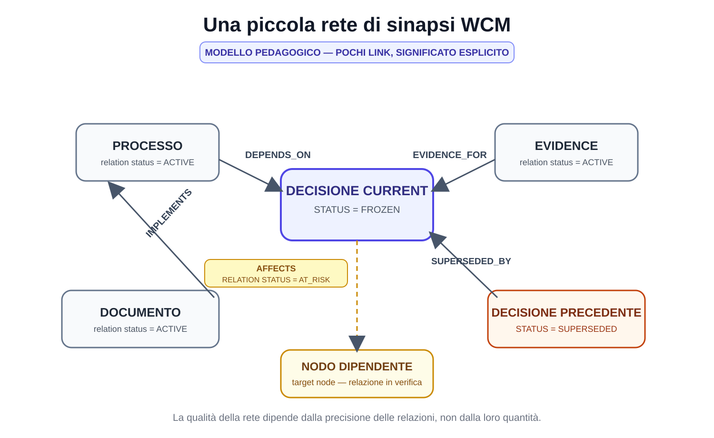

# Capitolo 08 — Le sinapsi: le relazioni tra i nodi

**Stato:** FROZEN  
**Blocco:** 2 — Knowledge Architecture  
**Scope:** WCM generale / domain-agnostic  
**Review:** Technical Review PASS / Human Comprehension Review PASS

---

## 8.0 Un nodo da solo ricorda. Una relazione spiega.

Nel capitolo precedente abbiamo trasformato la Persistent Organizational Memory da semplice raccolta di file in una rete di **nodi**.

Abbiamo visto che un nodo può rappresentare:

- una decisione;
- un processo;
- un protocollo;
- uno stato;
- un documento;
- un output;
- un'evidence;
- un learning;
- un requisito;
- un altro oggetto persistente materialmente rilevante.

Ma una rete non nasce perché esistono molti nodi.

Nasce quando il sistema conserva anche **le relazioni che li collegano**.

Consideriamo quattro oggetti:

```text
DECISIONE A
PROCESSO B
DOCUMENTO C
EVIDENCE D
```

Se sappiamo soltanto che esistono, la memoria può trovarli.

Ma deve ancora ricostruire ogni volta le domande più importanti:

- B dipende da A?
- C implementa B?
- D sostiene A?
- se A cambia, B deve essere rivalutato?
- C resta valido?
- D è ancora pertinente?

Se invece la memoria conserva:

```text
PROCESSO B
DEPENDS_ON → DECISIONE A

DOCUMENTO C
IMPLEMENTS → PROCESSO B

EVIDENCE D
EVIDENCE_FOR → DECISIONE A
```

una parte della causalità non vive più soltanto nella testa dell'umano o nel reasoning temporaneo dell'AI.

È diventata **memoria organizzativa persistente**.

WCM chiama queste relazioni **sinapsi**.

---

# 8.1 Che cos'è una sinapsi WCM

`PROT-013 Knowledge Synapse & Health Standard` definisce una sinapsi come:

> **una relazione tipizzata e intenzionale fra due nodi persistenti.**

Le due parole importanti sono:

**tipizzata** e **intenzionale**.

Tipizzata significa che la relazione possiede un significato dichiarato.

Non diciamo soltanto:

```text
A è collegato a B
```

ma:

```text
A DEPENDS_ON B
```

oppure:

```text
A IMPLEMENTS B
```

oppure:

```text
A EVIDENCE_FOR B
```

Intenzionale significa che il collegamento esiste perché aiuta a rispondere a una domanda reale.

Non per rendere il grafo più ricco.

Non per aumentare il numero di link.

Non perché due documenti usano parole simili.

Il principio è:

> **Una sinapsi esiste quando il tipo di relazione ha valore per reasoning, continuità, impatto, navigazione o assurance.**

---

# 8.2 Perché non è un semplice hyperlink

Un hyperlink dice:

> “Da qui puoi aprire quell'altro contenuto.”

Una sinapsi dice qualcosa in più:

> **“Questo nodo ha questa specifica relazione con quell'altro nodo.”**

Confrontiamo.

## Link generico

```text
Vedi: Decisione A
```

## Sinapsi

```text
PROCESSO B
DEPENDS_ON → DECISIONE A
```

Nel primo caso sappiamo che esiste una connessione editoriale.

Nel secondo sappiamo che se la Decisione A cambia, il Processo B può richiedere verifica.

È una differenza enorme.

L'hyperlink facilita la navigazione.

La sinapsi può supportare anche:

- impact analysis;
- lineage;
- assurance;
- dependency tracking;
- source reasoning;
- retrieval selettivo.

Per questo `CONCEPT-011` dice esplicitamente:

> **Una sinapsi non è un backlink decorativo.**

---

# 8.3 La domanda che giustifica una relazione

Una relazione WCM dovrebbe permettere di rispondere ad almeno una domanda utile.

Per esempio:

- da cosa dipende questo nodo?
- che cosa implementa?
- che cosa lo vincola?
- cosa può essere influenzato se cambia?
- quale evidence lo sostiene?
- da quale fonte deriva?
- quale elemento sostituisce?
- quale elemento lo ha sostituito?
- esiste una contraddizione dichiarata?
- esiste una relazione rilevante che non rientra nei tipi più specifici?

Se non sappiamo quale domanda la relazione aiuti a risolvere, probabilmente non abbiamo ancora una buona sinapsi.

---

# 8.4 Il vocabolario minimo generale

La baseline WCM definisce un vocabolario iniziale di relazioni generali:

```text
DEPENDS_ON
DERIVED_FROM
IMPLEMENTS
CONSTRAINS
AFFECTS
SUPERSEDES
SUPERSEDED_BY
EVIDENCE_FOR
CONTRADICTS
RELATED_TO
```

Questo vocabolario non pretende di descrivere ogni possibile dominio.

È una base generale.

Un contesto specifico può introdurre relazioni specialistiche quando servono davvero e quando il loro significato viene documentato.

La regola non è:

> “Usare sempre e solo questi dieci tipi.”

È:

> **Partire da un vocabolario piccolo e comprensibile; estenderlo solo quando il lavoro reale lo richiede.**

---

# 8.5 DEPENDS_ON — da cosa dipende questo nodo?

`DEPENDS_ON` esprime una dipendenza.

Schema:

```text
NODO A
DEPENDS_ON → NODO B
```

Significa:

> **A richiede B come condizione, fonte, vincolo o elemento necessario alla propria validità/funzione.**

Esempio astratto:

```text
PROCESSO DI APPROVAZIONE
DEPENDS_ON → DECISIONE DI GOVERNANCE
```

Se la decisione di governance viene modificata, il processo potrebbe non essere più valido nello stesso modo.

La relazione rende questa possibile conseguenza visibile.

Attenzione: `DEPENDS_ON` non deve essere usato per qualunque relazione vaga.

Deve esistere una dipendenza reale.

---

# 8.6 DERIVED_FROM — da che cosa deriva?

`DERIVED_FROM` indica origine o derivazione.

Schema:

```text
NODO A
DERIVED_FROM → NODO B
```

Può significare, per esempio:

- una sintesi deriva da una fonte;
- un learning deriva da evidence;
- una specifica deriva da una decisione;
- un read-model deriva da uno stato strutturato.

La domanda è:

> **Quale elemento precedente spiega la nascita o il contenuto di questo nodo?**

`DERIVED_FROM` riguarda l'origine.

`DEPENDS_ON` riguarda la dipendenza.

Le due cose possono coincidere in alcuni casi, ma non sono sinonimi.

---

# 8.7 IMPLEMENTS — che cosa realizza?

`IMPLEMENTS` collega un oggetto operativo a ciò che concretizza.

Schema:

```text
NODO A
IMPLEMENTS → NODO B
```

Esempio:

```text
COMPONENTE OPERATIVO
IMPLEMENTS → REQUIREMENT
```

oppure:

```text
PROCESSO
IMPLEMENTS → DECISIONE / POLICY
```

La relazione aiuta a rispondere:

> **Dove è stata resa operativa questa regola o esigenza?**

Se il requirement cambia, possiamo cercare i nodi che lo implementano.

---

# 8.8 CONSTRAINS — che cosa limita o governa?

`CONSTRAINS` esprime un vincolo.

Schema:

```text
NODO A
CONSTRAINS → NODO B
```

A può essere:

- una decisione;
- un protocollo;
- una policy;
- un requisito;
- un limite operativo.

B può essere:

- un processo;
- un workflow;
- un output;
- un altro nodo.

La relazione non significa che A “crea” B.

Significa che B deve operare entro un perimetro imposto da A.

---

# 8.9 AFFECTS — cosa può cambiare se cambia questo nodo?

`AFFECTS` è una relazione causale particolarmente importante.

Schema:

```text
NODO A
AFFECTS → NODO B
```

Significa:

> **Un cambiamento materiale in A può richiedere verifica, aggiornamento o rivalutazione di B.**

Non significa automaticamente:

> “B deve cambiare.”

Questa distinzione è fondamentale.

`AFFECTS` identifica un **potenziale impatto**.

La decisione su come trattare B arriva attraverso l'Impact Analysis e i processi applicabili.

Questa relazione è centrale in `CONCEPT-009 Decision Lineage & Causal Impact`.

---

# 8.10 SUPERSEDES e SUPERSEDED_BY — come ricordare il cambiamento senza cancellare la storia

Queste due relazioni rappresentano la successione.

```text
NODO NUOVO
SUPERSEDES → NODO VECCHIO
```

e reciprocamente:

```text
NODO VECCHIO
SUPERSEDED_BY → NODO NUOVO
```

Il vecchio nodo non viene cancellato.

Cambia status.

Esempio:

```text
DEC-OLD
STATUS = SUPERSEDED
SUPERSEDED_BY → DEC-NEW

DEC-NEW
STATUS = FROZEN
SUPERSEDES → DEC-OLD
```

Questa coppia di sinapsi costruisce il lineage.

Permette di ricostruire:

- cosa vale oggi;
- cosa valeva prima;
- come siamo arrivati alla situazione corrente.

---

# 8.11 EVIDENCE_FOR — che cosa sostiene questa evidenza?

`EVIDENCE_FOR` collega evidence a ciò che sostiene.

```text
EVIDENCE A
EVIDENCE_FOR → LEARNING B
```

oppure:

```text
EVIDENCE A
EVIDENCE_FOR → DECISIONE B
```

La relazione non trasforma l'evidence in authority.

Significa soltanto:

> **questa evidence è pertinente al supporto di questo nodo.**

Una decisione può essere sostenuta da evidence senza essere “prodotta automaticamente” dall'evidence.

Un learning può avere più evidence.

Una evidence può sostenere più nodi.

---

# 8.12 CONTRADICTS — quando la memoria sa che esiste una tensione

`CONTRADICTS` segnala una contraddizione rilevante.

```text
NODO A
CONTRADICTS → NODO B
```

Questa relazione è delicata.

Non dovrebbe essere generata automaticamente soltanto perché due testi contengono frasi diverse.

Potrebbero descrivere:

- momenti storici differenti;
- scope differenti;
- proposta vs decisione;
- evidence vs authority;
- versioni superseded.

`CONTRADICTS` richiede quindi attenzione semantica.

Quando la contraddizione è reale e materialmente utile da conservare, la sinapsi permette al sistema di non nasconderla.

---

# 8.13 RELATED_TO — la relazione più facile da abusare

`RELATED_TO` significa semplicemente che esiste una relazione pertinente non descritta meglio dagli altri tipi.

È utile.

Ma è anche pericolosa.

Se diventa:

```text
TUTTO RELATED_TO TUTTO
```

la rete perde informazione.

Una relazione troppo generica non aiuta più a capire:

- dipendenza;
- causalità;
- vincolo;
- provenienza;
- evidence;
- successione.

Per questo `CONCEPT-011` stabilisce che `RELATED_TO` non deve diventare un collegamento universale.

Regola pratica:

> **Se esiste un tipo più preciso, preferire il tipo più preciso.**

---

# 8.14 FIG-004 — Una piccola rete di sinapsi WCM



La figura mostra una rete volutamente piccola.

Al centro c'è una decisione.

Intorno:

- un processo che dipende dalla decisione;
- un documento che implementa il processo;
- un'evidence che sostiene la decisione;
- una decisione precedente superseded.

Il messaggio non è:

> “Un buon WCM deve avere molti collegamenti.”

È l'opposto:

> **Pochi collegamenti con significato esplicito valgono più di una rete densa ma ambigua.**

---

# 8.15 Una sinapsi ha anch'essa uno stato

Una relazione non deve essere considerata eternamente vera per il solo fatto di essere stata creata.

Gli status che seguono appartengono **alla sinapsi**, non necessariamente ai nodi collegati. Un nodo può restare perfettamente valido mentre una specifica relazione che lo collega a un altro nodo diventa `AT_RISK` o `BROKEN`.

`PROT-013` definisce stati baseline:

- `ACTIVE`;
- `AT_RISK`;
- `BROKEN`;
- `OPEN`;
- `SUPERSEDED`.

## ACTIVE

La relazione è corrente e verificata.

## AT_RISK

Un delta materiale può averla invalidata, ma non è ancora stata verificata.

## BROKEN

La relazione non è valida, per esempio perché il target richiesto non esiste più come riferimento valido.

## OPEN

La relazione è ipotetica o non confermata.

Non deve essere trattata come fatto.

## SUPERSEDED

La relazione appartiene alla storia ed è stata sostituita.

Questo introduce un'idea importante:

> **Anche la relazione è un oggetto che evolve nel tempo.**

---

# 8.16 Quando una sinapsi ACTIVE può essere considerata valida

Secondo `PROT-013`, una sinapsi `ACTIVE` è valida soltanto se, in sintesi:

1. source e target esistono o sono riferimenti esterni stabili e intenzionali;
2. il tipo è comprensibile e pertinente;
3. non contraddice silenziosamente uno stato più autorevole;
4. non punta a un nodo superseded come se fosse current;
5. la rationale è ricostruibile quando non è autoevidente;
6. è stata verificata dopo l'ultimo delta materiale che può averla influenzata.

La validità non è quindi soltanto:

> “il link si apre.”

È:

> **il collegamento è ancora semanticamente e organizzativamente corretto.**

---

# 8.17 Il target mancante: quando una sinapsi è BROKEN

Immaginiamo:

```text
PROCESSO A
DEPENDS_ON → DECISIONE B
```

ma la Decisione B non esiste più nel path previsto.

Potrebbero esserci più spiegazioni:

- B è stata cancellata erroneamente;
- B è stata rinominata;
- B è stata superseded;
- il link è sbagliato;
- la relazione non è più valida.

Il sistema deterministico può rilevare:

> “target non raggiungibile.”

Ma non sempre può sapere **perché**.

Per questo:

```text
TARGET MANCANTE
→ BROKEN
```

non autorizza automaticamente una correzione semantica.

Il Knowledge Steward può riparare automaticamente soltanto quando una repair class allowlisted dimostra un'unica soluzione corretta.

---

# 8.18 AT_RISK: non rotto, ma non ancora verificato

Supponiamo:

```text
DECISIONE A
AFFECTS → PROCESSO B
```

La Decisione A cambia.

La relazione verso B potrebbe essere ancora valida.

Oppure no.

Prima della verifica, il sistema può trattarla come:

```text
AT_RISK
```

Questo è un concetto importante perché evita due errori:

- dichiarare tutto rotto dopo ogni cambiamento;
- dichiarare tutto ancora valido senza controllo.

`AT_RISK` significa:

> **questa relazione potrebbe essere stata influenzata dal delta e richiede verifica.**

---

# 8.19 OPEN: una relazione ipotetica non è un fatto

Alcune relazioni possono essere proposte prima di essere confermate.

Per esempio:

```text
NODO A
MAY DEPEND_ON? → NODO B
```

La baseline usa `OPEN` per rappresentare una relazione ipotetica/non confermata.

Il principio è identico a quello già visto per Working Memory:

```text
IPOTESI ≠ DECISIONE
```

qui diventa:

```text
RELAZIONE IPOTETICA ≠ SINAPSI ACTIVE
```

Questo impedisce al sistema di trasformare una deduzione plausibile in una dipendenza ufficiale.

---

# 8.20 Relazioni interpretative: conservare anche lo status epistemico

`CONCEPT-011` stabilisce che una relazione interpretativa deve mantenere il proprio status, per esempio:

- `FACT`;
- `DECISION`;
- `HYPOTHESIS`;
- `PROPOSAL`;
- `OPEN`.

Questo è particolarmente importante quando la relazione non è puramente meccanica.

Un link:

```text
OUTPUT
DERIVED_FROM → SOURCE
```

può essere determinabile.

Una relazione:

```text
CONCEPT A
AFFECTS → STRATEGY B
```

può richiedere interpretazione.

WCM non vuole perdere questa differenza.

---

# 8.21 Cosa succede quando cambia un nodo

Qui le sinapsi diventano operative.

Supponiamo:

```text
DECISIONE A
        ↓
  ┌─────┼──────────┐
  ↓     ↓          ↓
PROC B  DOC C      REQ D
```

La Decisione A cambia.

Il sistema non deve aggiornare soltanto A.

Deve chiedere:

> **Quali relazioni entranti e uscenti sono materialmente coinvolte?**

`PROT-013` descrive il flusso:

```text
DELTA MATERIALE
      ↓
NODO/I CAMBIATI
      ↓
SINAPSI ENTRANTI / USCENTI RILEVANTI
      ↓
INDICI / LEDGER / MIRROR DIPENDENTI
      ↓
RECONCILIATION + HEALTH CHECK
```

Questo è il ponte tra sinapsi e Impact Set.

---

# 8.22 Impact Set: la parte della rete che dobbiamo guardare

`PROC-006 Memory Consolidation & Consistency Loop` richiede, dopo un delta materiale, di costruire un **Impact Set minimo**.

L'Impact Set può includere:

- current-facing mirrors;
- workflow checkpoints;
- indici;
- registri;
- living ledger;
- relationships;
- documentation projections.

Le sinapsi aiutano a individuare il perimetro.

Esempio:

```text
DEC-10 cambia
   ↓ AFFECTS
PROC-05
   ↓ IMPLEMENTS
DOC-02
```

Impact Set candidato:

```text
DEC-10
PROC-05
DOC-02
relative synapses
relative indexes
```

Questo non significa che tutti debbano essere modificati.

Significa che devono essere **verificati**.

---

# 8.23 Verificare non significa modificare

Questa distinzione è fondamentale.

Se A `AFFECTS` B e A cambia, il sistema non può concludere automaticamente:

> “modifica B.”

Può concludere:

> **“B entra nell'Impact Set e deve essere verificato.”**

L'esito può essere:

- ancora valido;
- da aggiornare;
- da supersedere;
- da rimuovere;
- da lasciare invariato ma con nuova rationale;
- unresolved.

La relazione abilita l'analisi.

Non sostituisce il giudizio o l'authority.

---

# 8.24 Sinapsi e Decision Lineage

Le decisioni mostrano bene il valore delle relazioni.

Pattern:

```text
ASSUNZIONE
   ↓ DEPENDS_ON / DERIVED_FROM
DECISIONE A
   ↓ AFFECTS
REQUISITO B
   ↓ IMPLEMENTS
OUTPUT C
```

Poi la decisione cambia:

```text
DECISIONE D
SUPERSEDES → DECISIONE A
```

La rete permette di ricostruire non soltanto la storia della decisione, ma anche i nodi che possono essere stati costruiti sopra la decisione precedente.

È ciò che `CONCEPT-009` chiama **Causal Memory Architecture**.

---

# 8.25 Il Relationship Ledger

Quando il volume di relazioni lo giustifica, `PROT-013` consente un `RELATIONSHIP_LEDGER.md`.

Una forma minima può contenere:

```text
ID
RELATION
SOURCE
TARGET
RATIONALE
STATUS
LAST_VERIFIED
```

`LAST_VERIFIED` indica l'ultima volta in cui la relazione è stata controllata rispetto al contesto corrente; non costituisce da sola una prova assoluta di correttezza semantica.

Il ledger non sostituisce necessariamente le relazioni nei documenti.

Può offrire una vista operativa centralizzata.

Anche qui vale la proporzionalità:

> **Non tutti i contesti hanno bisogno di un ledger dedicato.**

Il WCM richiede integrità delle relazioni.

Non burocrazia uniforme.

---

# 8.26 LAST_VERIFIED: una relazione può diventare stale

Una relazione può essere stata corretta ieri e non essere più verificata oggi.

Per esempio:

```text
REL-17
STATUS = ACTIVE
LAST_VERIFIED = T1
```

Poi:

```text
MATERIAL DELTA = T2
T2 > T1
```

Se quel delta può influenzare REL-17, la relazione non dovrebbe continuare a essere implicitamente considerata green senza nuovo controllo.

Questo concetto di freshness alimenta la Knowledge Health.

---

# 8.27 Nodi orfani

Un nodo è `ORPHAN` quando, per la sua funzione e maturità, dovrebbe possedere relazioni significative o essere raggiungibile dagli entry point pertinenti, ma non lo è.

Esempio:

```text
DECISIONE MATERIALMENTE IMPORTANTE
- esiste;
- è current;
- nessun index la raggiunge;
- nessun nodo dipendente la cita;
- nessun percorso di bootstrap conduce a essa.
```

Potrebbe essere un orphan.

Ma `PROT-013` chiarisce:

> **Non tutti i file senza link sono automaticamente orphan.**

Un asset, uno storico o un file autosufficiente potrebbe non richiedere relazioni.

La classificazione dipende dal ruolo.

---

# 8.28 Perché i nodi orfani sono pericolosi

Un nodo orfano può produrre un problema paradossale:

> l'organizzazione sa qualcosa, ma non sa di saperlo nel momento in cui serve.

Il file esiste.

Ma:

- INDEX-FIRST non lo trova;
- Impact Analysis non lo include;
- un nuovo agente non lo recupera;
- un cambio correlato non lo aggiorna.

La conoscenza è persistita.

Ma non è realmente integrata nella memoria organizzativa.

---

# 8.29 Sinapsi rotte

Una sinapsi rotta può essere:

- target mancante;
- target superseded usato come current;
- relazione semanticamente non più valida;
- source non più pertinente;
- path non valido;
- status incoerente.

Non tutte hanno la stessa severità.

Una relazione decorativa rotta può essere irrilevante.

Una relazione critica di authority o state può rendere insicuro il bootstrap.

Per questo Knowledge Health non usa soltanto un conteggio.

Considera il tipo e la severità.

---

# 8.30 Più sinapsi non significa migliore Knowledge Health

Questa è una delle regole più importanti del protocollo.

`PROT-013` contiene un vero **anti-gaming invariant**:

> **Più sinapsi ≠ Knowledge Health migliore.**

Una rete con 1.000 link inutili può essere peggiore di una rete con 50 relazioni precise.

La densità non è qualità.

Le metriche di crescita servono per osservare l'evoluzione.

Non per premiare collegamenti artificiali.

---

# 8.31 Le dimensioni della Knowledge Health

`CONCEPT-011` descrive componenti trasparenti della salute della knowledge:

- `state_consistency`;
- `decision_propagation`;
- `relationship_validity`;
- `ledger_freshness`;
- `orphan_control`;
- `open_drifts`.

Vediamole brevemente.

## state_consistency

Lo stato autorevole e le viste current-facing non si contraddicono.

## decision_propagation

Le decisioni materiali sono riflesse nei nodi dichiarati dipendenti.

## relationship_validity

Le sinapsi sono valide, a rischio o rotte in modo osservabile.

## ledger_freshness

I living ledger necessari sono aggiornati rispetto ai delta che li riguardano.

## orphan_control

I nodi che dovrebbero essere connessi non rimangono invisibili.

## open_drifts

Le incoerenze note non vengono nascoste.

---

# 8.32 Gli stati di Knowledge Health

La baseline prevede:

- `HEALTHY`;
- `DEGRADED`;
- `STALE`;
- `CRITICAL`;
- `UNKNOWN`.

## HEALTHY

Gli invarianti dichiarati sono soddisfatti e il check è sufficientemente fresco.

## DEGRADED

La memoria è utilizzabile ma contiene drift/debt/anomalie note non bloccanti.

## STALE

L'assurance è precedente a un delta materiale o alcune viste richieste non sono state ancora verificate.

## CRITICAL

Esiste un problema che rende insicuro bootstrap, authority, continuità o esecuzione.

## UNKNOWN

Non esiste evidence sufficiente per classificare.

Questi stati descrivono la qualità **osservata e verificata** della memoria.

Non una certezza assoluta.

---

# 8.33 L'invariante di freshness

Uno dei controlli più chiari è:

```text
LAST_KNOWLEDGE_CHECK
<
LAST_MATERIAL_DELTA

⇒ HEALTHY VIETATO
```

Se il sistema è cambiato dopo l'ultimo check, il vecchio check non può dimostrare che la nuova situazione sia ancora healthy.

Questo non significa automaticamente che la memoria sia sbagliata.

Significa:

> **la verifica non è abbastanza fresca per dichiararla HEALTHY.**

Lo stato può diventare `STALE` finché il check non viene aggiornato.

---

# 8.34 Assurance: controllare la rete

`PROC-008 Knowledge Integrity Assurance Loop` esegue il controllo della memoria risultante.

La sequenza generale è:

```text
DETERMINISTIC HEALTH CHECK
       ↓
PASS?
 ├─ YES → telemetry / checkpoint → STOP
 └─ NO
       ↓
classify anomaly
       ↓
ALLOWLISTED + DETERMINISTIC?
 ├─ YES → controlled repair → re-check
 └─ NO → NO WRITE → escalation
```

I controlli minimi includono:

- state consistency;
- decision propagation;
- relationship validity;
- ledger freshness;
- orphan control;
- source/index reachability;
- health freshness.

La rete diventa quindi non soltanto persistente.

Diventa **verificabile**.

---

# 8.35 Perché deterministic-first

Molti failure di relazione sono meccanici.

Esempio:

- path inesistente;
- fingerprint stale;
- nodo target mancante;
- timestamp di check più vecchio del delta;
- indice che non raggiunge una fonte prevista.

Per questi controlli non serve necessariamente un LLM.

Un checker deterministico può essere:

- più economico;
- ripetibile;
- verificabile;
- idempotente.

Il principio di `PROC-008` è:

> **DETERMINISTIC FIRST.**

La cognizione entra quando il problema richiede interpretazione.

---

# 8.36 Auto-repair: il limite deve essere molto stretto

Il fatto che un problema sia rilevato automaticamente non significa che possa essere corretto automaticamente.

`PROT-013` e `PROC-008` impongono un confine forte.

Una repair automatica richiede:

- repair class esplicita;
- precondition deterministiche;
- write scope definito;
- unica soluzione dimostrabile;
- re-check obbligatorio;
- evidence;
- rollback tramite history.

Anti-pattern vietato:

```text
NON-GREEN
→ modifica finché diventa GREEN
```

Il checker non deve ottimizzare il punteggio.

Deve preservare la verità organizzativa.

---

# 8.37 Quando il sistema deve fermarsi senza scrivere

L'auto-repair è vietata quando:

- due fonti autorevoli confliggono;
- serve scegliere il significato;
- una relazione `AT_RISK` dovrebbe diventare `ACTIVE` tramite interpretazione;
- un target rotto potrebbe essere rinominato, cancellato o superseded e non sappiamo quale;
- la correzione cambierebbe canone, goal, roadmap, strategia, requisito o governance;
- serve inventare una relazione semantica.

In questi casi:

```text
NO WRITE
→ WISE / AUTHORITY / GATE
```

Questa è una caratteristica importante della Knowledge Architecture WCM:

> **la capacità di riconoscere un gap non autorizza a riempirlo inventando significato.**

---

# 8.38 Il ruolo del Knowledge Steward

Il Knowledge Steward può mantenere:

- indici;
- link;
- relazioni già determinate;
- ledger;
- health telemetry;
- propagazione di authority già esistente;
- drift strutturale.

Ma non può:

- scegliere quale authority sia semanticamente vera in un conflitto;
- inventare causalità;
- cambiare canone;
- risolvere interpretazioni controverse;
- promuovere un'ipotesi a fatto.

Il Knowledge Steward mantiene la rete.

Non diventa il legislatore della rete.

---

# 8.39 Sinapsi e INDEX-FIRST

Le sinapsi aiutano anche il retrieval.

Un agente arriva su un nodo e può vedere:

```text
DEPENDS_ON → ...
CONSTRAINED_BY → ...
DERIVED_FROM → ...
```

Questo può indicare quali fonti leggere dopo.

Non significa seguire automaticamente ogni collegamento.

`PROT-005 Index-First Progressive Retrieval` resta valido:

> **Navigate first, retrieve progressively, stop when sufficient.**

Le sinapsi migliorano la mappa.

Non eliminano il Retrieval Gate.

---

# 8.40 Sinapsi e source precedence

Una relazione non sovrascrive la gerarchia delle fonti.

Se:

```text
NODE A
RELATED_TO → NODE B
```

e B è una fonte inferiore rispetto alla baseline autorevole, il link non rende B authoritative.

Le sinapsi dicono:

> “esiste questa relazione”.

La source precedence dice:

> “quale peso attribuire alle fonti quando rispondiamo a una domanda.”

Le due dimensioni cooperano.

---

# 8.41 Sinapsi e Persistent Organizational Memory

A questo punto possiamo affinare ancora la definizione della memoria persistente.

Non è soltanto:

```text
NODI
```

È:

```text
NODI
+
RELAZIONI TIPIZZATE
+
STATUS
+
FRESHNESS
+
ASSURANCE
```

Una memoria organizzativa matura deve sapere:

- cosa esiste;
- cosa significa;
- cosa dipende da cosa;
- quali relazioni sono ancora valide;
- quali sono a rischio;
- quali sono rotte;
- quali nodi sono orfani;
- quanto è fresca la verifica.

---

# 8.42 Una rete piccola ma significativa

Immaginiamo due memorie.

## Memoria A

```text
2.000 file
7.500 link
nessun tipo di relazione
nessuno status
nessun last_verified
```

## Memoria B

```text
250 nodi materiali
180 sinapsi tipizzate
status esplicito
source precedence
orphan control
assurance corrente
```

Non possiamo concludere automaticamente che B sia migliore soltanto dai numeri.

Ma B possiede proprietà organizzative che A non possiede.

Il punto è:

> **il valore non è la quantità di connessioni, ma la loro utilità verificabile.**

---

# 8.43 Un esempio completo di propagazione

Partiamo da:

```text
DEC-100
STATUS = FROZEN

PROC-200
DEPENDS_ON → DEC-100

DOC-300
IMPLEMENTS → PROC-200

EVD-400
EVIDENCE_FOR → DEC-100
```

Arriva una nuova decisione:

```text
DEC-101
SUPERSEDES → DEC-100
```

Il sistema può costruire:

```text
MATERIAL DELTA
DEC-100 → SUPERSEDED
DEC-101 → FROZEN
        ↓
RELATION IMPACT
PROC-200 DEPENDS_ON DEC-100 → AT_RISK
DOC-300 via PROC-200 → candidate impact
EVD-400 remains historical evidence for DEC-100
        ↓
IMPACT SET
DEC-100
DEC-101
PROC-200
DOC-300
relevant indexes / ledgers / relations
        ↓
VERIFY
        ↓
UPDATE / KEEP / SUPERSEDE / ESCALATE
```

La rete non decide tutto.

Ma rende il perimetro molto più visibile.

---

# 8.44 Cosa non fa una sinapsi

È importante anche dire cosa **non** fa.

Una sinapsi:

- non rende automaticamente vero un contenuto;
- non conferisce authority;
- non impone sempre una modifica;
- non sostituisce il processo decisionale;
- non sostituisce source precedence;
- non rende necessario un graph database;
- non deve essere creata per ogni somiglianza;
- non risolve conflitti semantici;
- non autorizza semantic auto-repair.

È una struttura di memoria.

Non una scorciatoia per il giudizio.

---

# 8.45 Failure mode tipici

## Failure 1 — backlink decorativi

Molti link, poco significato.

## Failure 2 — RELATED_TO universale

La rete diventa indistinta.

## Failure 3 — relazioni senza status

Un'ipotesi viene trattata come dipendenza certa.

## Failure 4 — target superseded trattato come current

La storia invade la baseline attiva.

## Failure 5 — broken relation ignorata

Il retrieval o l'impact analysis usano una dipendenza non più valida.

## Failure 6 — nodo materiale orfano

La conoscenza esiste ma non è raggiungibile.

## Failure 7 — delta senza synapse impact

Il nodo cambia, le relazioni restano stale.

## Failure 8 — auto-repair semantico

Il sistema inventa il significato necessario a chiudere il checker.

## Failure 9 — densità premiata come qualità

Si crea linking artificiale.

## Failure 10 — health check più vecchio del delta

Il sistema continua a dichiararsi HEALTHY senza evidence corrente.

---

# 8.46 Dove siamo arrivati

Chiudiamo il capitolo con quattordici idee essenziali.

1. Una sinapsi è una relazione tipizzata e intenzionale tra nodi.
2. Un hyperlink non è automaticamente una sinapsi.
3. La relazione deve rispondere a una domanda utile.
4. Il vocabolario generale parte da pochi tipi comprensibili.
5. `DEPENDS_ON`, `DERIVED_FROM`, `IMPLEMENTS`, `CONSTRAINS` e `AFFECTS` descrivono relazioni diverse.
6. `SUPERSEDES / SUPERSEDED_BY` preservano lineage.
7. `EVIDENCE_FOR` collega evidence senza trasformarla in authority.
8. `CONTRADICTS` richiede cautela semantica.
9. `RELATED_TO` non deve diventare universale.
10. Le sinapsi possono essere `ACTIVE`, `AT_RISK`, `BROKEN`, `OPEN` o `SUPERSEDED`.
11. Un delta materiale richiede verifica delle relazioni pertinenti.
12. Le sinapsi aiutano a costruire l'Impact Set, ma verificare non significa modificare.
13. Nodi orfani, relazioni rotte e freshness entrano nella Knowledge Health.
14. Più sinapsi non significa migliore memoria: conta la qualità delle dipendenze.

Con questo capitolo si completa il nucleo del Blocco 2 — **Knowledge Architecture**.

Abbiamo ora:

```text
NODI
+
SINAPSI
=
MEMORIA ORGANIZZATIVA A RETE
```

Nel blocco successivo affronteremo un altro problema.

Una rete può diventare molto grande.

Come fa WCM a trovare **soltanto ciò che serve**, senza leggere tutto?

La risposta è il **Knowledge Navigation Layer** e il principio **INDEX-FIRST**.

---

# Frozen Source Map — 08

Fonti canoniche principali usate per questa stesura:

- `wcm/kb/concepts/CONCEPT-011_KNOWLEDGE_SYNAPSE_ASSURANCE.md` — definizione di sinapsi, vocabolario generale, regole, Knowledge Health e health invariant;
- `wcm/process-book/protocols/PROT-013_KNOWLEDGE_SYNAPSE_HEALTH_STANDARD.md` — definizioni operative, status delle relazioni, validity, Material Delta → Synapse Impact, orphan node, metriche, assurance e controlled repair;
- `wcm/kb/concepts/CONCEPT-009_DECISION_LINEAGE_CAUSAL_IMPACT.md` — decisione come nodo causale, lineage, AFFECTS, DEPENDS_ON e Causal Memory Architecture;
- `wcm/process-book/processes/PROC-006_MEMORY_CONSOLIDATION_LOOP.md` — Impact Set, typed relations, Consistency Bundle e propagazione del delta;
- `wcm/process-book/processes/PROC-008_KNOWLEDGE_INTEGRITY_ASSURANCE_LOOP.md` — deterministic health check, relationship validity, orphan control, freshness e auto-repair boundary.

## Figura collegata

- `FIG-004_WCM_SYNAPSE_NETWORK.svg` — nuova figura pedagogica del Capitolo 08: rete piccola di nodi con relazioni tipizzate e status.

## Review Closure

- Technical Review — PASS;
- Human Comprehension Review — PASS;
- sinapsi ≠ backlink decorativo — verified;
- relazione tipizzata e intenzionale — verified;
- vocabolario baseline aderente a PROT-013 — verified;
- `AFFECTS` = candidate impact / verifica, non modifica automatica — verified;
- `OPEN` ≠ fatto — verified;
- `BROKEN` non autorizza semantic repair — verified;
- `AT_RISK` = relazione da verificare dopo delta pertinente — verified;
- orphan node proporzionato alla funzione/maturità — verified;
- più sinapsi ≠ health migliore — verified;
- HEALTHY vietato con assurance precedente all'ultimo material delta — verified;
- PROC-006 ≠ PROC-008 — verified;
- scope generale / nessun riferimento project-specific — PASS;
- FIG-004 — APPROVED / EMBEDDED / VISUAL QA PASS.

**Freeze verdict:** `CHAPTER 08 FROZEN — 2026-08-28`.
