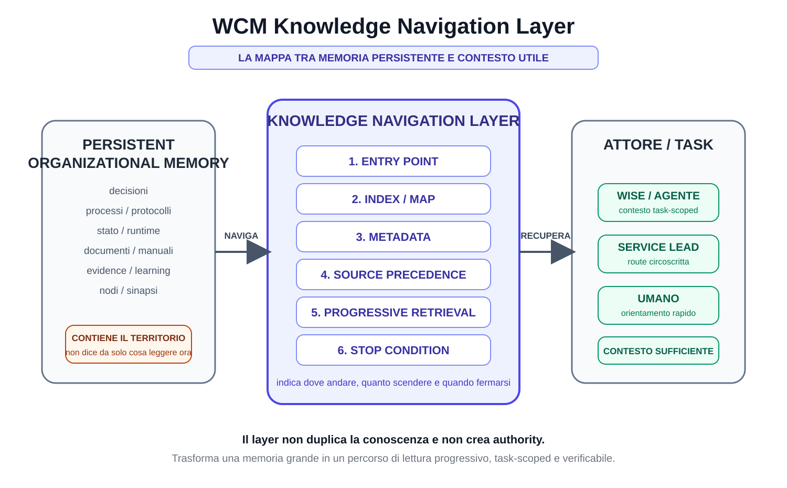

# Capitolo 10 — Il Knowledge Navigation Layer

**Stato:** FROZEN  
**Parte:** IV — INDEX-FIRST: come WCM trova quello che gli serve  
**Scope:** WCM generale / domain-agnostic  
**Review:** Technical Review PASS / Human Comprehension Review PASS

---

## 10.0 Una memoria grande ha bisogno di una mappa

Nel Capitolo 09 abbiamo incontrato un problema apparentemente paradossale.

Una memoria organizzativa può diventare molto ricca e, proprio per questo, più difficile da usare.

Non perché sia disordinata.

Non perché contenga necessariamente errori.

Ma perché, davanti a una richiesta concreta, il sistema deve capire:

- da dove partire;
- quale indice aprire;
- quali fonti sono pertinenti;
- quali hanno maggiore authority;
- quanto approfondire;
- quando fermarsi.

WCM risponde introducendo un livello logico fra la memoria persistente e chi deve usarla.

Questo livello si chiama:

**Knowledge Navigation Layer**.

La sua funzione può essere riassunta così:

> **La memoria conserva il territorio. Il Knowledge Navigation Layer indica il percorso utile per attraversarlo.**

---

# 10.1 Dove si trova il layer

Il Knowledge Navigation Layer non è una cartella unica.

Non è un database separato.

Non è un nuovo agente.

Non è una seconda copia della Knowledge Base.

È un **layer logico** composto da strumenti e regole che cooperano.

CONCEPT-007 lo colloca fra:

~~~text
PERSISTENT ORGANIZATIONAL MEMORY
              ↓
    KNOWLEDGE NAVIGATION LAYER
              ↓
         ATTORE / TASK
~~~

L'attore può essere:

- Wise;
- un altro agente autorizzato;
- un Service Lead;
- un umano che deve orientarsi;
- un runtime cognitivo futuro compatibile con il metodo.

La funzione resta la stessa:

> portare l'attore dalla grande memoria al **contesto minimo sufficiente** per il task.

---

# 10.2 FIG-005 — La mappa fra memoria e attore

La figura mostra i sei elementi principali che useremo in questo capitolo:

1. Entry Point;
2. Index / Map;
3. Metadata;
4. Source Precedence;
5. Progressive Retrieval;
6. Stop Condition.

Non sono sei archivi diversi.

Sono sei funzioni della navigazione.

Insieme permettono di rispondere a sei domande:

~~~text
DOVE INIZIO?
DOVE DEVO ANDARE?
CHE COSA STO GUARDANDO?
QUALE FONTE PREVALE?
QUANTO DEVO APPROFONDIRE?
QUANDO POSSO FERMARMI?
~~~

---

# 10.3 Il layer non contiene la conoscenza: la rende raggiungibile

Questa distinzione è fondamentale.

Supponiamo che la memoria persistente contenga:

- una decisione;
- il protocollo che la implementa;
- una evidence che ne spiega l'origine;
- una versione superseded;
- un manuale che la descrive;
- uno stato operativo che la applica.

Il Knowledge Navigation Layer non crea un nuovo documento che ricopia tutto.

Cerca invece di rendere visibile:

~~~text
ENTRY POINT
→ indice pertinente
→ decisione corrente
→ protocollo applicabile
→ evidence solo se necessaria
~~~

Il contenuto resta nelle fonti originali.

Il layer contiene soprattutto **orientamento**.

---

# 10.4 Perché duplicare la conoscenza sarebbe un errore

Immaginiamo un layer costruito così:

~~~text
MEMORIA ORIGINALE
        ↓
COPIA RIASSUNTIVA DI TUTTO
        ↓
ATTORE
~~~

Avremmo creato un secondo patrimonio da mantenere.

Ogni variazione della memoria dovrebbe propagarsi anche nella copia.

Nascono immediatamente domande pericolose:

- quale delle due è aggiornata?
- quale è source of truth?
- cosa succede se divergono?
- la sintesi ha perso un'eccezione importante?
- chi garantisce la sincronizzazione?

Per questo WCM evita di trasformare il navigation layer in una memoria parallela.

La regola è:

> **la mappa deve puntare al territorio, non sostituirlo.**

---

# 10.5 Primo componente: Entry Point

Ogni sistema navigabile ha bisogno di un punto di ingresso.

Nel WCM generale il punto di ingresso corrente è:

~~~text
WCM_AGENT_START.md
~~~

Il suo compito non è spiegare tutto il WCM.

Anzi, se diventasse un manuale completo perderebbe la propria funzione.

Un buon Entry Point deve essere:

- piccolo rispetto alla memoria complessiva;
- stabile;
- facilmente individuabile;
- affidabile e corrente;
- capace di instradare verso le fonti autorevoli e le mappe più specifiche.

È simile all'ingresso di una metropolitana.

Non contiene tutta la città.

Permette di capire quale linea prendere.

---

# 10.6 Un Entry Point non è una home page decorativa

Un file può chiamarsi start, readme o index e non essere un vero Entry Point.

Per esserlo deve aiutare materialmente a ricostruire il contesto.

Per esempio deve poter indicare:

- il modello generale di bootstrap;
- gli entry point specialistici;
- la source precedence;
- le principali stop condition;
- le regole di trust;
- le route verso Architecture, Method KB, Process Book, Documentation o altri layer pertinenti.

Un Entry Point utile riduce la domanda:

> "Dove devo cercare?"

Un Entry Point puramente descrittivo può invece lasciare l'attore ancora davanti all'intero repository.

---

# 10.7 Entry Point generale ed Entry Point specifici

Il sistema può avere più livelli di ingresso.

Esempio concettuale:

~~~text
ENTRY POINT GENERALE
        ↓
AREA / PROJECT / SERVICE ENTRY POINT
        ↓
INDEX SPECIFICO
~~~

Questo evita due estremi.

## Un unico Entry Point gigantesco

Contiene tutto.

Diventa difficile da mantenere e da leggere.

## Nessun Entry Point comune

Ogni attore deve conoscere già la struttura interna.

La navigazione dipende dalla memoria personale.

WCM preferisce una gerarchia:

> **un ingresso generale piccolo, poi ingressi e indici più specifici quando il task lo richiede.**

---

# 10.8 Secondo componente: Index / Map

Dopo l'Entry Point serve una mappa.

Un indice WCM non è soltanto un elenco alfabetico di file.

Può rappresentare:

- quali nodi esistono;
- che ruolo hanno;
- quali sono correnti;
- quali aree coprono;
- dove trovare authority, processi, decisioni o evidence;
- quali route seguire per domande diverse.

Il Method KB Index, per esempio, non contiene il testo completo dei concetti.

Dice quali concetti esistono e quale domanda aiutano a risolvere.

Questo è molto più utile che presentare all'agente una directory senza semantica.

---

# 10.9 Directory e indice non sono la stessa cosa

Una directory risponde soprattutto:

> "Quali file ci sono qui?"

Un indice ben progettato risponde anche:

> "Perché dovrei aprire questo file?"

Confrontiamo.

## Directory

~~~text
FILE-A.md
FILE-B.md
FILE-C.md
FILE-D.md
~~~

## Index

~~~text
FILE-A → governance corrente
FILE-B → processo applicabile al bootstrap
FILE-C → evidence storica
FILE-D → concetto ancora in validazione
~~~

La seconda struttura riduce il lavoro interpretativo.

L'indice diventa una prima forma di **compressione semantica della navigazione**.

Non comprime il contenuto.

Comprime il percorso necessario per trovarlo.

---

# 10.10 Un buon indice deve dire abbastanza, non tutto

Se ogni voce dell'indice contenesse pagine di spiegazione, l'indice diventerebbe un nuovo manuale.

Se contenesse soltanto nomi di file, sarebbe poco più di una directory.

Il punto di equilibrio è fornire metadata navigazionali sufficienti.

Per esempio:

- titolo;
- tipo;
- status;
- breve funzione;
- scope;
- eventuale domanda principale;
- link alla fonte.

Il dettaglio vero resta nel nodo.

L'indice deve permettere di decidere **se aprirlo**.

---

# 10.11 Terzo componente: Metadata

I metadata aiutano il sistema a capire che cosa sta guardando prima di leggerne tutto il contenuto.

CONCEPT-007 propone, quando utili, campi come:

~~~yaml
DOCUMENT_ID:
TYPE:
STATUS:
SCOPE:
OWNER:
READ_WHEN:
AUTHORITY:
DEPENDS_ON:
SUPERSEDES:
EVIDENCE:
~~~

Questa lista non va interpretata come uno schema universale obbligatorio per ogni file storico.

La baseline è esplicita:

> lo standard viene applicato progressivamente ai documenti attivi e alle nuove baseline quando è utile.

Il principio importante è un altro:

> **una fonte dovrebbe rendere riconoscibile la propria natura senza obbligare l'attore a dedurla da tutto il testo.**

---

# 10.12 Metadata come segnali stradali

Pensiamo ai metadata come ai segnali di una strada.

Un cartello può dirci:

~~~text
CENTRO → 4 km
AEROPORTO → 12 km
STRADA CHIUSA
ACCESSO RISERVATO
~~~

Non descrive la destinazione.

Ma cambia il modo in cui decidiamo il percorso.

Nel WCM:

- STATUS = SUPERSEDED può evitare di usare una fonte come corrente;
- TYPE = EVIDENCE impedisce di confonderla con una decisione;
- SCOPE evita trasferimenti impropri fra contesti;
- AUTHORITY aiuta a capire il peso della fonte;
- READ_WHEN può indicare quando vale la pena approfondirla.

---

# 10.13 Metadata non significa verità automatica

I metadata sono utili soltanto se sufficientemente affidabili.

Scrivere:

~~~text
STATUS = ACTIVE
~~~

non rende magicamente attivo un documento.

Se il metadata contraddice una fonte superiore o uno stato deterministico applicabile, deve essere verificato.

Quindi:

> **metadata aiutano il routing; non sostituiscono authority e assurance.**

Questo collega il Knowledge Navigation Layer alla Knowledge Health.

Una mappa con cartelli sbagliati può guidare molto rapidamente nella direzione sbagliata.

---

# 10.14 Quarto componente: Source Precedence

Una volta raggiunte più fonti pertinenti, il layer deve aiutare a capire quale peso attribuire loro.

La logica generale WCM è, in forma semplificata:

~~~text
GOVERNANCE / MANDATE
        ↓
CANON / ACTIVE BASELINE
        ↓
SPECIFIC CONTRACT / AUTHORITY
        ↓
VALIDATED PROCESS / PROTOCOL
        ↓
CURRENT STATE
        ↓
DECISIONS / LIVING KNOWLEDGE
        ↓
EVIDENCE
        ↓
OPEN CONCEPT
        ↓
RAW / HISTORICAL
~~~

Per gli execution facts esistono inoltre regole specifiche che possono dare precedenza a runtime strutturato e Derived State.

Il Capitolo 12 entrerà nel dettaglio.

Qui basta capire la funzione:

> **la navigazione non deve soltanto trovare fonti; deve evitare di trattarle come equivalenti.**

---

# 10.15 La source precedence è parte della mappa

Potremmo pensare che la source precedence appartenga soltanto alla fase decisionale.

In realtà influenza già la navigazione.

Se abbiamo due possibili route:

~~~text
ROUTE A → baseline corrente
ROUTE B → discussion storica
~~~

non è efficiente aprirle entrambe automaticamente.

La precedence suggerisce:

~~~text
prima A
poi B solo se manca qualcosa,
serve lineage,
o emerge un conflitto
~~~

Quindi source precedence e progressive retrieval cooperano.

La prima ordina le fonti.

Il secondo decide quanto scendere.

---

# 10.16 Quinto componente: Progressive Retrieval

Ora arriviamo al movimento vero e proprio nella memoria.

CONCEPT-007 e PROT-005 descrivono quattro livelli logici:

~~~text
L0 — IDENTITÀ / ROUTE
Entry Point

L1 — MAPPA
Index pertinente

L2 — AUTHORITY / PROCEDURE
fonti necessarie al task

L3 — EVIDENCE / DEEP CONTEXT
solo se serve verifica, conflitto o ragione storica
~~~

L'idea non è che ogni task debba attraversare obbligatoriamente tutti e quattro i livelli.

È l'opposto.

> **si scende soltanto finché serve.**

---

# 10.17 L0 — Capire dove siamo

L0 deve risolvere le domande iniziali.

Per esempio:

- chi è l'attore?
- quale area sta trattando?
- esiste una route nota?
- c'è un workflow da riprendere?
- quale entry point specifico deve essere aperto?

L0 non dovrebbe ancora caricare il dettaglio profondo.

È orientamento.

È il momento in cui diciamo:

> "Sono qui e, per questa domanda, devo entrare da quella porta."

---

# 10.18 L1 — Capire quali fonti esistono

L1 è la mappa.

Qui l'attore individua:

- l'indice pertinente;
- le categorie disponibili;
- le fonti candidate;
- gli status;
- le route possibili.

Il risultato di L1 non dovrebbe essere:

> "Ho letto tutto."

Dovrebbe essere:

> **"So quali due o tre fonti devo probabilmente aprire."**

Questa è una differenza sostanziale.

---

# 10.19 L2 — Leggere authority e procedure necessarie

L2 è il livello operativo principale.

Qui vengono aperte le fonti realmente necessarie al task.

Possono essere, a seconda della richiesta:

- governance;
- decisione frozen;
- processo;
- protocollo;
- stato corrente;
- specific contract;
- requirement;
- runtime pertinente.

L2 deve permettere di risolvere:

- cosa vale;
- cosa è consentito;
- quale procedura si applica;
- quale stato conta;
- cosa viene dopo.

Molti task dovrebbero potersi fermare qui.

---

# 10.20 L3 — Evidence, storico e deep context

L3 è il livello profondo.

È prezioso.

Ma non è il bootstrap standard.

Si apre quando serve, per esempio:

- capire perché una decisione è nata;
- verificare un claim;
- risolvere un conflitto;
- ricostruire lineage;
- confrontare alternative;
- eseguire un audit;
- promuovere evidence verso una baseline.

Questo protegge il task corrente dal rischio di trascinare nel contesto tutto il passato.

---

# 10.21 Scendere di livello richiede una ragione

PROT-005 stabilisce una regola precisa:

> il passaggio a un livello successivo deve essere motivato da un'informazione mancante, da una contraddizione o da una necessità di verifica.

Questa frase trasforma il retrieval in un processo controllato.

Non facciamo:

~~~text
L0 → L1 → L2 → L3
sempre
~~~

Facciamo:

~~~text
L0
↓
mi basta?
├─ sì → STOP
└─ no → L1

L1
↓
mi basta?
├─ sì → STOP
└─ no → L2
...
~~~

Il Capitolo 11 formalizzerà questo comportamento come percorso operativo.

---

# 10.22 Il Retrieval Gate

Prima di aprire una nuova fonte, PROT-005 propone quattro domande:

1. quale informazione manca?
2. questo file è probabilmente la fonte più autorevole per quella informazione?
3. l'informazione è già disponibile in una fonte letta?
4. il task richiede davvero questo livello di dettaglio?

Queste domande possono sembrare banali.

Ma impediscono un comportamento molto comune:

> continuare a leggere perché esistono altri documenti disponibili.

Il Retrieval Gate distingue curiosità e necessità.

Solo la necessità operativa deve governare l'espansione del contesto.

---

# 10.23 Sesto componente: Stop Condition

Il Knowledge Navigation Layer sarebbe incompleto senza una regola di arresto.

Perché un sistema molto potente può continuare a trovare nuova conoscenza quasi indefinitamente.

WCM usa il principio:

> **Stop When Sufficient.**

Il bootstrap generale considera sufficiente il contesto quando l'attore conosce, con sufficiente confidenza:

- ruolo;
- progetto o goal;
- Working Memory affidabile disponibile;
- authority;
- stato esecutivo pertinente;
- eventuale workflow da riprendere;
- trust status;
- processi/protocolli applicabili;
- file/relazioni necessari;
- azioni vietate o escalation;
- true stop condition.

Non ogni task richiederà tutte queste dimensioni nello stesso modo.

Ma il principio è:

> **fermarsi quando le informazioni necessarie all'azione corretta sono disponibili.**

---

# 10.24 Stop Condition non significa "prima risposta trovata"

Un motore di ricerca potrebbe trovare una risposta plausibile in pochi secondi.

Questo non significa che il Context Sufficiency Gate sia superato.

Per esempio potrebbe ancora mancare:

- authority;
- status;
- scope;
- un workflow già in corso;
- una contraddizione con una fonte superiore;
- una stop condition.

Quindi:

~~~text
RISPOSTA PLAUSIBILE
≠
CONTESTO SUFFICIENTE
~~~

La sufficienza è legata al task e al rischio.

---

# 10.25 La navigazione usa anche la Working Memory

Il layer non lavora esclusivamente sulla repository.

PROC-005 integra Working Memory e Persistent Organizational Memory.

Se il contesto vivo contiene già informazioni recenti e affidabili, possono essere riutilizzate.

Questo evita un rituale inefficiente:

~~~text
SO GIÀ X
↓
RILEGGO TUTTO PER RITROVARE X
~~~

Ma resta valida la regola:

~~~text
MEMORY IS NOT AUTHORITY
~~~

Se il task richiede conferma di stato, authority o baseline, la fonte persistente corretta deve essere verificata quando necessario.

---

# 10.26 Delta preferred

PROT-005 introduce un principio molto utile nei follow-up:

> **Delta preferred.**

Significa:

> se il contesto di base è già affidabile, privilegiare ciò che è cambiato invece di rileggere tutto.

Esempio concettuale:

~~~text
BASELINE CONOSCIUTA
+
NUOVO DELTA
=
CONTESTO AGGIORNATO
~~~

non:

~~~text
NUOVO DELTA
→ DIMENTICA TUTTO
→ RICOSTRUISCI DA ZERO
~~~

Questo è uno dei punti in cui Dual Memory e Knowledge Navigation si incontrano.

---

# 10.27 Navigazione e Resume Priority

PROC-005 contiene anche una regola che precede il normale retrieval di nuovo lavoro:

> **prima di cercare nuovo lavoro, verificare se esiste un workflow incompleto da riprendere.**

Questo è importante perché la navigazione non riguarda soltanto "quale documento leggere".

Riguarda anche:

> **quale percorso operativo è già in corso?**

Se esiste un workflow ACTIVE con true stop non raggiunta o INTERRUPTED_RESUMABLE, la route corretta può essere:

~~~text
RESUME
~~~

non:

~~~text
DISCOVER NEW TASK
~~~

Il layer aiuta quindi a recuperare non soltanto conoscenza, ma anche continuità operativa.

---

# 10.28 La Knowledge Trust Gate protegge la mappa

Una mappa è utile se è affidabile.

WCM_AGENT_START prevede una Knowledge Trust Gate prima di affidarsi agli entry point e agli indici in percorsi sensibili.

Segnali di possibile drift possono essere:

- stato e runtime incompatibili;
- index che punta a una baseline superata;
- relazione critica BROKEN;
- Knowledge Health STALE, CRITICAL o UNKNOWN;
- current-facing mirror non coerente.

In questi casi non si deve scegliere "il documento che sembra più giusto".

Si deve attivare la procedura di assurance o reconciliation applicabile.

---

# 10.29 Navigation Layer e Knowledge Health sono complementari

Possiamo esprimere la relazione così:

~~~text
NAVIGATION LAYER
= DOVE ANDARE

KNOWLEDGE HEALTH
= QUANTO POSSO FIDARMI DELLA MAPPA
  RISPETTO AGLI INVARIANTI VERIFICATI
~~~

Se la navigation è ottima ma la mappa è stale, il sistema può raggiungere velocemente una fonte sbagliata.

Se la Knowledge Health è buona ma non esiste navigazione, il sistema può avere una memoria corretta ma costosa da esplorare.

Servono entrambe.

Knowledge Health aumenta la fiducia nella mappa rispetto agli invarianti effettivamente verificati; non garantisce una verità assoluta di ogni contenuto.

---

# 10.30 Il layer non conferisce authority

Questa distinzione merita di essere ripetuta.

Se un indice dice:

~~~text
LEGGI DOCUMENTO B
~~~

non significa:

~~~text
DOCUMENTO B È AUTOREVOLE PERCHÉ LO DICE L'INDICE
~~~

L'indice orienta.

L'authority deriva dalla governance e dalla natura della fonte.

Allo stesso modo:

- un metadata non crea authority;
- un link non crea authority;
- una sinapsi non crea authority;
- una posizione alta nell'indice non crea authority.

Il navigation layer **trasporta verso l'authority**.

Non la produce.

---

# 10.31 Il layer non decide il contenuto

Un altro confine importante:

> il navigation layer non sostituisce la cognition.

Può indicare:

~~~text
queste sono le fonti pertinenti
questa è la loro precedenza
questo è lo status
qui manca una verifica
~~~

Ma interpretare il significato di una situazione complessa può richiedere ancora:

- reasoning;
- confronto;
- decision support;
- authority umana;
- un gate.

La navigazione riduce il problema.

Non elimina la necessità di capire.

---

# 10.32 Il layer non è un motore di ricerca

Un motore di ricerca è uno strumento possibile dentro un'architettura di retrieval.

Ma il Knowledge Navigation Layer è più ampio.

Una ricerca può trovare:

> "documenti semanticamente simili alla domanda"

Il layer deve anche considerare:

- entry point;
- status;
- source precedence;
- scope;
- workflow in corso;
- route;
- progressive depth;
- stop condition.

Quindi:

~~~text
SEARCH
⊂
NAVIGATION
~~~

La ricerca può aiutare la navigazione.

Non la sostituisce.

---

# 10.33 Il layer non richiede una tecnologia unica

WCM definisce un'architettura logica.

Non impone che il Knowledge Navigation Layer debba essere implementato attraverso:

- graph database;
- vector database;
- motore RAG specifico;
- search engine specifico;
- un determinato LLM.

La baseline corrente usa strumenti semplici e persistenti come:

- entry point Markdown;
- indici;
- metadata;
- typed relations;
- runtime strutturato;
- source precedence;
- regole di retrieval.

Tecnologie future possono rendere il layer più potente.

Ma il principio architetturale resta indipendente dal singolo prodotto.

---

# 10.34 Agent-Ready non significa agent-only

Il nome **Agent-Ready Knowledge Architecture** potrebbe suggerire che questa struttura serva soltanto alle AI.

Non è così.

Gli stessi meccanismi aiutano anche un umano.

Un nuovo collaboratore, per esempio, beneficia di:

- un punto di ingresso;
- una mappa;
- status chiari;
- source of truth distinguibili;
- storico separato dal corrente;
- route comprensibili.

La differenza è che, per un agente, questi elementi diventano ancora più importanti perché riducono la dipendenza da contesto implicito e memoria personale.

---

# 10.35 Un esempio astratto completo

Immaginiamo una richiesta:

> "Devo capire quale procedura applicare a questa operazione."

Senza navigation layer:

~~~text
repository
↓
ricerca generica
↓
12 documenti plausibili
↓
manuale
↓
vecchia decisione
↓
protocollo current
↓
evidence
↓
confusione
~~~

Con navigation layer:

~~~text
ENTRY POINT
↓
PROCESS / PROTOCOL INDEX
↓
metadata: ACTIVE / scope corretto
↓
source precedence
↓
protocollo current
↓
contesto sufficiente?
   ├─ sì → STOP
   └─ no → evidence mirata
~~~

La differenza non è solo velocità.

È **qualità del percorso**.

---

# 10.36 Il layer come riduzione dello spazio di ricerca

Possiamo rappresentare il problema in modo intuitivo.

Supponiamo che la memoria contenga mille nodi.

Il task non richiede mille nodi.

Forse ne richiede cinque.

Il navigation layer cerca di trasformare:

~~~text
1000 POSSIBILI FONTI
~~~

in:

~~~text
10 CANDIDATE
↓
3 FONTI NECESSARIE
↓
1 CONTESTO OPERATIVO
~~~

I numeri sono puramente illustrativi: non rappresentano una performance target o una metrica WCM.

Il principio è la riduzione progressiva dello **spazio di ricerca**.

---

# 10.37 Riduzione non significa perdita

A prima vista ridurre il contesto potrebbe sembrare pericoloso.

Ma il layer non cancella le altre fonti.

Le mantiene raggiungibili.

La differenza è:

~~~text
NON CARICATE ADESSO
≠
NON ESISTONO
~~~

Questo è uno dei vantaggi di una memoria persistente ben navigabile.

Possiamo mantenere profondità storica senza trascinarla in ogni task.

---

# 10.38 Proporzionalità

Non tutti i task hanno bisogno della stessa profondità.

Una domanda semplice può richiedere:

~~~text
L0 → L1 → L2 → STOP
~~~

Un audit può richiedere:

~~~text
L0 → L1 → L2 → L3 → confronto trasversale
~~~

Una recovery operativa può richiedere prima:

~~~text
runtime workflow checkpoint
→ Resume Priority
~~~

La navigation architecture non impone quindi lo stesso itinerario a tutto.

Impone la stessa disciplina:

> **route esplicita, profondità motivata, stop quando sufficiente.**

---

# 10.39 Che cosa rende il layer "Agent-Ready"

Possiamo ora precisare la definizione.

Un layer è Agent-Ready quando permette a un agente autorizzato, senza conoscenza pregressa, di ricostruire progressivamente:

- identità e ruolo;
- route;
- stato rilevante;
- authority;
- procedure;
- fonti necessarie;
- next transition;
- stop condition.

CONCEPT-007 considera questa architettura già implementata nella baseline, ma ancora in validazione sul campo per aspetti come:

- bootstrap completo;
- misurazione comparativa file/token;
- ripresa cross-session;
- scalabilità multi-progetto.

Quindi:

> **Agent-Ready è una proprietà architetturale perseguita e già supportata dalla baseline, non un claim di efficienza perfetta in ogni scenario.**

---

# 10.40 Come valutare se il layer sta funzionando

CONCEPT-007 e PROT-005 indicano metriche utili da osservare nel tempo:

- file letti per bootstrap/task;
- token di bootstrap;
- percentuale di file letti realmente utilizzati;
- tempo al primo atto utile;
- conflitti di fonte intercettati;
- letture non pertinenti;
- delta retrieval rispetto a full reload.

Queste metriche non sono ancora una promessa universale di performance.

Servono a trasformare un principio qualitativo in una futura validazione misurabile.

---

# 10.41 Failure mode: Entry Point troppo grande

Se l'Entry Point cresce fino a contenere:

- tutti i processi;
- tutti i protocolli;
- tutte le decisioni;
- tutto lo storico;

il sistema torna vicino al full reload.

Failure:

~~~text
ENTRY POINT
=
MINI REPOSITORY
~~~

Correzione concettuale:

> l'Entry Point deve orientare, non sostituire tutte le fonti.

---

# 10.42 Failure mode: Index senza status

Un indice che elenca fonti senza distinguere:

- ACTIVE;
- OPEN;
- SUPERSEDED;
- EVIDENCE;
- HISTORICAL;

può aumentare il rischio di errore.

L'attore trova velocemente i file.

Ma non sa ancora quale usare.

La navigazione ha risolto la geografia, non l'autorità.

---

# 10.43 Failure mode: Metadata decorativi

Aggiungere metadata ovunque non migliora automaticamente il sistema.

Se:

- non vengono mantenuti;
- non vengono usati nel routing;
- sono contraddittori;
- duplicano informazioni senza controllo;

diventano burocrazia.

Il principio WCM resta proporzionale:

> **metadata quando migliorano materialmente discoverability, authority, status o routing.**

---

# 10.44 Failure mode: Source precedence ignorata

Un sistema può avere ottimi indici e trovare subito cinque fonti.

Se poi le sintetizza tutte come equivalenti, il navigation layer è incompleto.

Failure:

~~~text
FIND CORRECTLY
+
WEIGH INCORRECTLY
=
WRONG CONTEXT
~~~

Per questo source precedence è un componente strutturale, non una nota a margine.

---

# 10.45 Failure mode: non fermarsi mai

Un altro failure è:

~~~text
CONTESTO SUFFICIENTE
↓
"VEDIAMO COMUNQUE SE C'È ALTRO"
↓
NUOVE FONTI
↓
NUOVO RUMORE
~~~

La capacità di fermarsi è una competenza architetturale.

Non un limite.

Un buon retrieval non massimizza il numero di documenti consultati.

Massimizza la probabilità di avere **quelli giusti**.

---

# 10.46 Failure mode: fermarsi troppo presto

Esiste il problema opposto.

~~~text
PRIMA RISPOSTA PLAUSIBILE
↓
STOP
~~~

senza verificare:

- status;
- authority;
- scope;
- trust;
- workflow corrente;

può essere altrettanto pericoloso.

Per questo la Stop Condition non è una sensazione.

È un **Context Sufficiency Gate** proporzionato al task.

---

# 10.47 Dal file system a una knowledge navigation architecture

Possiamo ora ricostruire l'evoluzione vista fin qui.

~~~text
FILE SYSTEM
↓
NODI
↓
SINAPSI
↓
ENTRY POINT + INDEX + METADATA
↓
SOURCE PRECEDENCE
↓
PROGRESSIVE RETRIEVAL
↓
STOP WHEN SUFFICIENT
~~~

Ogni strato risolve un problema diverso.

- i file persistono;
- i nodi danno identità;
- le sinapsi danno relazioni;
- gli indici danno orientamento;
- la precedence dà gerarchia;
- il retrieval dà movimento;
- la stop condition dà controllo.

Questa combinazione è ciò che rende la memoria **navigabile**.

---

# 10.48 Dove siamo arrivati

Chiudiamo con dodici idee.

1. Il Knowledge Navigation Layer è un layer logico fra memoria persistente e attore.
2. Non è una seconda memoria, un database obbligatorio o un nuovo centro di authority.
3. L'Entry Point indica da dove iniziare.
4. L'Index trasforma una directory in una mappa semantica.
5. I metadata aiutano a riconoscere tipo, status, scope e ruolo delle fonti.
6. La Source Precedence impedisce di trattare fonti diverse come equivalenti.
7. Il Progressive Retrieval usa livelli L0–L3 e non obbliga a scendere sempre fino al deep context.
8. Ogni espansione del contesto deve avere una ragione.
9. La Stop Condition ferma il retrieval quando il contesto è sufficiente.
10. Working Memory, delta retrieval e Resume Priority rendono la navigazione context-aware e session-independent.
11. Knowledge Trust Gate e Knowledge Health proteggono l'affidabilità della mappa.
12. Agent-Ready descrive una baseline implementata e in field validation, non una scalabilità universale già dimostrata.

Nel Capitolo 09 la domanda era:

~~~text
COME EVITIAMO CHE UNA MEMORIA GRANDE
DIVENTI TROPPO GRANDE DA USARE?
~~~

Ora abbiamo visto i componenti della risposta.

Nel prossimo capitolo faremo qualcosa di diverso.

Non descriveremo più il layer dall'esterno.

Lo useremo.

Seguiremo **INDEX-FIRST passo per passo**, da L0 fino alla Stop Condition, e vedremo il Retrieval Gate in azione.

---

# Frozen Source Map — 10

Fonti canoniche principali usate:

- WCM_AGENT_START.md — Entry Point generale, Knowledge Trust Gate, source precedence, retrieval stop condition e bootstrap corrente;
- wcm/kb/index.md — Method KB Index e regola index-first corrente;
- wcm/kb/concepts/CONCEPT-007_AGENT_READY_KNOWLEDGE_ARCHITECTURE.md — definizione Agent-Ready, Knowledge Navigation Layer, Entry Point, metadata, L0–L3, source precedence e metriche;
- wcm/process-book/processes/PROC-005_AGENT_READY_CONTEXT_BOOTSTRAP.md — Context Sufficiency Gate, Working Memory integration, Resume Priority e bootstrap progressivo;
- wcm/process-book/protocols/PROT-005_INDEX_FIRST_PROGRESSIVE_RETRIEVAL.md — Retrieval Gate, source precedence, task scope, progressive disclosure, delta preferred e Stop When Sufficient;
- wcm/documentation/process-memory-book/chapters/09_il_problema_della_conoscenza_troppo_grande.md — continuità pedagogica con il problema introdotto nel capitolo precedente.

## Figura collegata

- FIG-005_WCM_KNOWLEDGE_NAVIGATION_LAYER.svg — mappa pedagogica del layer tra Persistent Organizational Memory e attore/task.

## Review Closure

- Technical Review — PASS dopo micro-correzioni;
- Human Comprehension Review — PASS dopo micro-correzioni;
- Knowledge Navigation Layer = layer logico, non nuova memoria — verified;
- Entry Point ≠ authority — verified;
- Index ≠ directory — verified;
- metadata ≠ verità automatica / schema universale obbligatorio — verified;
- Source Precedence = componente della navigazione — verified;
- L0–L3 = progressive depth, non sequenza obbligatoria completa — verified;
- L3 = deep context on demand, non livello vietato — verified;
- Retrieval Gate — verified;
- Stop When Sufficient ≠ prima risposta plausibile — verified;
- Working Memory ≠ authority — verified;
- Delta Preferred — verified;
- Resume Priority correttamente limitata al bootstrap operativo — verified;
- Knowledge Trust Gate / Knowledge Health — verified senza claim di verità assoluta;
- Search ≠ Navigation — verified;
- technology neutrality — verified;
- Agent-Ready = baseline implementata / field validation in progress — verified;
- nessun claim universale di efficienza — verified;
- scope generale / nessun riferimento project-specific — PASS;
- FIG-005 — APPROVED / EMBEDDED / visual QA da completare nella release Word.

**Freeze verdict:** CHAPTER 10 FROZEN — 2026-08-29.
